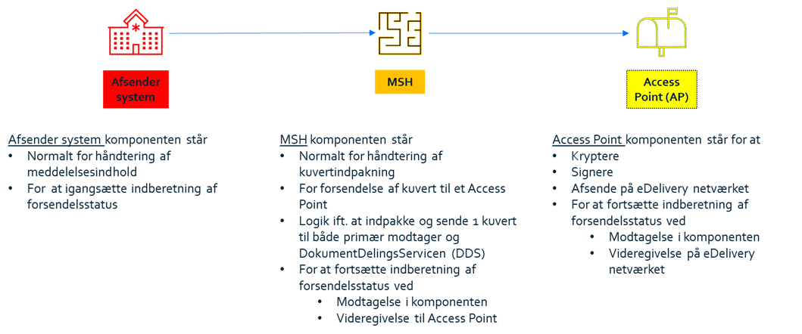

# EHMI End User Application Responsibility Specification (EUA)

([CHG]: Nogenlunde samme introtekst står på landing page - skal den ikke fjernes her?)
In MedCom13, MedCom has a joint testing project 'Municipal test responses on new infrastructure', where MedCom's two central modernization tracks are linked: FHIR and EHMI, where both message communication and the infrastructure are modernized. The modernization is due to the need for quality improvement in, among other things, security, transparency, robustness and efficient, international digital message communication. The project will conduct an operational test from March 1 to May 31, 2025. In the test, the new FHIR standard for municipal test responses must be sent from municipal emergency functions (EOJ) to general medical practices (LPS) via the new infrastructure EHMI (Enhanced Healthcare Messaging Infrastructure). The standard must be sent via eDelivery, and EHMI functionalities such as document sharing and shipment status (Track'n'Trace) must also be tested.

This page describes the required EHMI tasks and responsibilities for the End User Application . Relevant links can be found at the end of the document.

Background information - illustration and explanation of components

There are 3 components involved in sending/receiving a message:
1. EUA (Sender/receiver system)
2. MSH (Message Service Handler)
3. AP (Access Point)

These components can be combined in different ways by the suppliers. Regardless of the combination, the suppliers must comply with the responsibility specification.

<figure style="margin-left: 0px; margin-right: 0px; width: 100%;">

<figcaption text-align="left"><b>Figure 1: The 3 components involved in sending/receiving a message (Figure must be translated to english!!!)</b></figcaption>
</figure>

([CHG]: Fin figur! På modtagersiden sker der lidt noget andet - skal der ikke laves en tilsvarende figur for modtageren? Eller måske kunne man kombinere det til en figur med seks 'stationer'?) 

## EHMI Delivery Status - EUA responsibility description:

The following prerequisites for the End User Application apply:

- The End User Application is a component that is assumed to be relevant to the clinical users in a healthcare domain. It can be a stand-alone application, integrated with MSH, integrated with an EHMI AP or integrated with both (both MSH and EHMI AP)
- The End User Application must be able to generate MedCom messages or data content corresponding to a MedCom message. It must be able to pass on a MedCom message or the data content of a MedCom message via an interface to MSH.
- The End User Application must be able to provide MSH with sufficient metadata such that the MSH is able to create an SBDH envelope for both the primary recipient and the secondary recipient in the form of XDS metadata for document sharing. ([CHG]: Skal EHMI regulere hvordan formatet for 'metadata-oplysninger' skal være mellem EUA og MSH? Bør selve formatet ikke overlades til applikations-udviklerne?)

As an additional task, the End User Application (EUA) must be able to communicate with the EHMI Delivery Status repository (track’n’trace).

The EHMI Delivery Status repository has a reporting API that the End User Application (EUA) must communicate via. It is based on an OAuth-secured REST interface based on the FAPI2 security profile. 

For the collection of EHMI Delivery Status, it is required that, cf. section 6.3.1 of the Architectural Vision, explicit signing is made between the EHMI Delivery Status “client” and the “server” (with associated verification) at system evidence level (VOCES/FOCES/Level 3). ([CHG]: Skal denne sætning ikke stå under EDS? Og den bør modificeres lidt, integritet og fortrolighed sikres i EDS kommunikationen via transportlaget.)

In addition, in this context, there is a requirement that the collection ([CHG]: Kan vi bruge et andet ord? 'Collection' giver associationer til en pull-model. Men vi skal nok ikke bruger 'delivery' ;-)) is carried out via an asynchronous decoupling mechanism (queue) to ensure that no EHMI Delivery Status data is lost ([CHG]: EUA'en skal kunne afsende meddelelser selvom EDS ikke er tilgængelig (skal det stå som separat krav?), det sikret kravet om asynkron afkobling også.).

In the test ([CHG]: Produktionspiloten?), the display of shipment status is expected to be done via a central solution, but there is a possibility that the business system can implement a local display in the business system. Access to the display will be subject to the same security requirements as for reporting, see 6.3.3 in the MB. ([CHG]: Bør denne sætning ikke stå under EDS i stedet?)

## EHMI Addressing Service - EUA responsibility description:

The End User Application must be able to integrate with the EHMI Addressing Service (EAS). The EHMI Addressing Service (EAS) will offer a search functionality that in the first version can retrieve shipping data for your own general practitioner. The EHMI Addressing Service (EAS) is currently being specified.

## Relevante links:

*_Danish:_*

- [Målbillede for meddelelseskommunikation på sundhedsområdet](https://sundhedsdatastyrelsen.dk/-/media/sds/filer/rammer-og-retningslinjer/referenceaktitektur-og-it-standarder/referencearkitektur/maalbillede-for-meddelelseskommunikation.pdf)
- [SDN](https://medcom.dk/systemforvaltning/sundhedsdatanettet-sdn/)

*_English:_*

- [EU eDelivery](https://ec.europa.eu/digital-building-blocks/wikis/display/DIGITAL/eDelivery) 
- [EU AP specifikationer](https://ec.europa.eu/digital-building-blocks/wikis/display/DIGITAL/Access+Point+specifications)
- [EU PEPPOL SBDH envelope](https://docs.peppol.eu/edelivery/envelope/Peppol-EDN-Business-Message-Envelope-2.0.0-2023-03-13.pdf) ([CHG]: Jeg får en 404 fejl på linket)

<!--
EHMI Komponent	Delopgave	Hvem	Optionel ift. afprøvningen af EHMI
Forsendelsesstatus: Indrapporterings-API	Implementering i fagsystem	Fagsystemet	
Forsendelsesstatus: Visnings-API	Implementering i fagsystem	Fagsystemet	Optionel – mulighed
Forsendelsesstatus: Visningsskærmbillede	Implementering i fagsystem	Fagsystemet	Optionel – mulighed
-->

<!--
EHMI Komponent	Delopgave	Hvem
Sundheds-adresseringsservice: API for anvendere	Integration til Sundheds-adresseringsservice	Fagsystemet
-->

