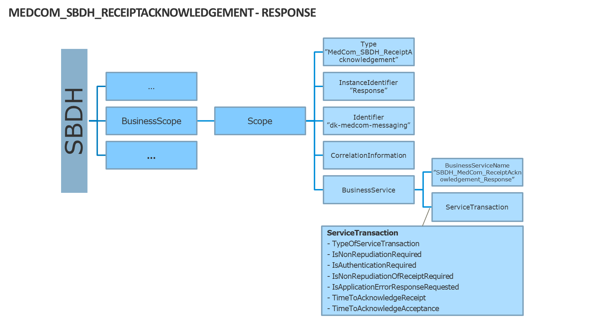

<!--

XYZ

Min undertitel

,

| ** |   |
|----------------------------------------------------------------|---|

Revisionshistorik

| Version | Initialer | Dato | Beskrivelse |
|---------|-----------|------|-------------|
|         |           |      |             |
|         |           |      |             |

Indhold

[Revisionshistorik](#_Toc162258780)

[1.](#)

[1.1](#-1)

[1.1.1](#-2)

[2. Glossary](#_Toc162258784)

[3. Referencer [ToBeUpdated]](#_Toc162258785)

[4. SBDH – Generelle elementer](#_Toc162258786)

[4.1 Generelt](#_Toc162258787)

[4.2 StandardBusinessDocument](#_Toc162258788)

[4.2.1 SBDH for en MedCom meddelelse og en MedCom kvittering](#_Toc162258789)

[4.2.2 SBDH for en ehmiEnvelopeReceipt](#_Toc162258790)

[4.3 SBDH – Fast definerede generelle elementer](#_Toc162258791)

[4.3.1 HeaderVersion](#headerversion)

[4.3.2 Sender](#_Toc162258793)

[4.3.3 Receiver](#_Toc162258794)

[4.3.4 DocumentInformation](#_Toc162258795)

[4.3.5 Manifest (bevidst udeladt i Produktionspilotversionen)](#_Toc162258796)

[5. SBDH BusinessScopes](#_Toc162258797)

[5.1 BusinessScope for generel eDelivery meddelelseskommunikation](#_Toc162258798)

[5.1.1 Sammenhæng til SMP](#_Toc162258799)

[*5.1.2* DOCUMENTID](#_Toc162258800)

[5.1.3 PROCESSID](#_Toc162258801)

[5.2 SBDH BusinessScope – sundhedsmeddelelseskommunikation](#_Toc162258802)

[5.2.1 Scope – message metadata - who](#_Toc162258803)

[5.2.2 Scope – message metadata - what](#_Toc162258804)

[5.3 SBDH BusinessScope – XDS-Metadata](#_Toc162258805)

[5.3.1 Dokumentdeling XDS-Metadata](#_Toc162258806)

[5.4 SBDH BusinessScope – Reliable messaging](#_Toc162258807)

[5.4.1 Reliable messaging - BusinessService Request](#_Toc162258808)

[5.4.2 Reliable messaging - BusinessService Response](#_Toc162258809)

[5.4.3 SBDH ReceiptAcknowledgement](#_Toc162258810)

[5.4.4 Receipt Exception](#_Toc162258811)

[5.5 SBDH BinaryContent – den indeholdte meddelelse](#_Toc162258812)

# 

## 

### 

# Glossary

| **Phrase** | **Abbreviation for**              | **Description** | **Domain** |
|------------|-----------------------------------|-----------------|------------|
| SBD        | Standard Business Document        |                 | PEPPOL     |
| SBDH       | Standard Business Document Header |                 | PEPPOL     |
| EHMIAck    | EHMI Envelope Receipt             |                 |            |
| SMP        | Service Metadata Provider         |                 | eDelivery  |
| SML        | Service Metadata Locator          |                 | eDelivery  |
| GS1        | [TBD]                             |                 | GS1        |
| PEPPOL     | [TBD]                             |                 | PEPPOL     |
|            | [TBD]                             |                 | eDelivery  |
| AP         | [TBD]                             |                 | eDelivery  |
| MSH        | [TBD]                             |                 | EHMI       |
| EER        | EHMI Endpoint Register            |                 | EHMI       |
| EDS        | EHMI Delivery Status              |                 | EHMI       |

# Referencer [ToBeUpdated]

| **Reference**             | **Navn**                                                                                   | **Filnavn**                                                   | **Placering**                                                                                                                                                                                                                                                   |
|---------------------------|--------------------------------------------------------------------------------------------|---------------------------------------------------------------|-----------------------------------------------------------------------------------------------------------------------------------------------------------------------------------------------------------------------------------------------------------------|
| [Policy_identifiers]      | PEPPOL Transport Infrastructure  ICT - Models  Policy for use of Identifiers, Version: 4.0 | PEPPOL-EDN-Policy-for-use-of-identifiers-4.0-2019-01-28.pdf   | <https://docs.peppol.eu/edelivery/policies/PEPPOL-EDN-Policy-for-use-of-identifiers-4.0-2019-01-28.pdf>                                                                                                                                                         |
| [DKEDEL_PIV_CodeList]     | DK_EDEL Code Lists - Participant identifier schemes v7.2                                   | DK_EDEL Code Lists - Participant identifier schemes v7.2.xlsx | <https://medcomtest.sharepoint.com/:x:/s/MedComModerniseringsPilot2020/EQSLr01jvoROrbkqCd6yhvQBLUyxUPPAP_MX2WTBjMGRaQ?e=THfhXm>                                                                                                                                 |
| [DKEDEL_TP_CodeList]      | Dansk eDelivery Code Lists - Transport profiles v7.2                                       | Dansk eDelivery Code Lists - Transport profiles v7.2.xlsx     | <https://medcomtest.sharepoint.com/:x:/s/MedComModerniseringsPilot2020/EdlEjIlLDadJuy7RjD926bkB0X5X-0m1JuQG_VF8Je2f-g?e=4b7jF8>                                                                                                                                 |
| [DKEDEL_DT_CodeList]      | Dansk eDelivery Code Lists - Document types v7.2. (MedCom meddelelser)                     | Dansk eDelivery Code Lists - Document types v7.2.xlsx         | <https://medcomtest.sharepoint.com/:x:/r/sites/MedComModerniseringsPilot2020/Delte%20dokumenter/eDelivery/Dansk%20eDelivery/DK_EDEL%20Code%20Lists%20-%20Document%20types%20v7.2%20-%2020211122.xlsx?d=wf68cc9cce4594eae8b8c8d26c828280c&csf=1&web=1&e=H5LYNJ>  |
| [PEPPOL_SBDH12]           | PEPPOL Business Message Envelope (SBDH) 1.2                                                | PEPPOL-EDN-Business-Message-Envelope-1.2-2019-02-01.pdf       | <https://medcomtest.sharepoint.com/:b:/s/MedComModerniseringsPilot2020/EeWbN0HnqcZMhel_56f8tCcB7G-boIwnP5PeoMAsDU5lCQ?e=gXR3cY>                                                                                                                                 |
| [DDS Metadata]            | DDS Metadata-v096                                                                          | DDS Metadata-v096.docx                                        | <http://svn.medcom.dk/svn/drafts/Standarder/IHE/DK_profil_metadata/Metadata-v096.docx>                                                                                                                                                                          |
| [DDS_Metadata- ValueSets] | DK-IHE_Metadata-Common_Code_systems-Value_sets                                             | DK-IHE_Metadata-Common_Code_systems-Value_sets.xlsx           | <http://svn.medcom.dk/svn/drafts/Standarder/IHE/OID/DK-IHE_Metadata-Common_Code_systems-Value_sets.xlsx>                                                                                                                                                        |
| [ebXMLbp]                 | ebxmlbp-v2.0.4-Spec-os-en                                                                  | ebxmlbp-v2.0.4-Spec-os-en.pdf                                 | <https://docs.oasis-open.org/ebxml-bp/2.0.4/OS/spec/ebxmlbp-v2.0.4-Spec-os-en.pdf>                                                                                                                                                                              |
| [SBDHschema]              | Standard Business Document Header Schema for pilot                                         | MedComStandardBusinessDocumentHeader_20210217.xsd             | <https://medcomtest.sharepoint.com/:u:/s/MedComModerniseringsPilot2020/EdudZoIaoXtAgC_PhWGKvCwBscQxkP54bYLqWQPx86SxuQ?e=bITgGk>                                                                                                                                 |
| EER                       | EHMI Endpoint Register                                                                     | [TBD]                                                         | [TBD]                                                                                                                                                                                                                                                           |
| EDS                       | EHMI Delivery Status                                                                       | [TBD]                                                         | [TBD]                                                                                                                                                                                                                                                           |
| [SMP Specification]       |                                                                                            | [TBD]                                                         | [TBD]                                                                                                                                                                                                                                                           |

# SBDH – Generelle elementer

## Generelt

StandardBusinessDocumentHeader (SBDH) er en konvolutspecifikation udstedt af GS1 og profileret til anvendelse i PEPPOL. Den understøttes af eDelivery's Access Points (AP) ift. AS4 protokollen. Vi følger i EHMI konventionerne, som er udlagt i PEPPOLs profilering, men udvider den også til at kunne passe på sundhedsområdet. SBDH er dog ingenting uden en omgivende container, kaldet StandardBusinessDocument (SBD).

## StandardBusinessDocument

StandardBusinessDocument er som nævnt SBDHs omgivende container, og er en wrapper rundt om SBDH, og indeholder kun to elementer:

-   StandardBusinessDocumentHeader
    -   BinaryContent (base64-encodet)

Selvom StandardBusinessDocument, som sådan er konvolutten, bruges termen SBDH generelt om hele konvolutten, da det er dette indhold som er særligt interessant i meddelelsesudvekslingen.

BinaryContent er elementet som indeholder en base64-encodet meddelelse eller kvittering for en afsendt SBDH.

Indholdet i SBDH er for en stor dels vedkommende bestemt af hvorledes

-   de samme informationer registreres i EER
-   de samme informationer registreres i SMP
-   sammenhængen er til DokumentDelingsServicen DDS
-   sammenhængen er til ehmiEnvelopeReceipt
-   de samme informationer registreres i EDS

SBDH har en struktur, der overordnet er delt ind i følgende elementer:

-   HeaderVersion
-   Sender
-   Receiver
-   DocumentInformation
-   Manifest
-   BusinessScope

### SBDH for en MedCom meddelelse og en MedCom kvittering

I en SBDH for en MedCom meddelelse og en MedCom kvittering kan følgende metadata indgå:

-   Generelle SBDH metadata
-   Metadata for eDelivery generel meddelelseskommunikation
-   Metadata for sundhedsmeddelelseskommunikation
-   XDS Metadata for Dokumentdeling
-   Metadata for Reliable messaging - BusinessService Request

### SBDH for en ehmiEnvelopeReceipt

I en SBDH for en ehmiEnvelopeReceipt er der følgende metadata:

-   Generelle SBDH metadata
-   Metadata for eDelivery generel meddelelseskommunikation
-   Metadata for sundhedsmeddelelseskommunikation
-   Metadata for Reliable messaging - BusinessService Response

## SBDH – Fast definerede generelle elementer

SBDH’s generelle elementer er illustreret i nedenstående figur.

BusinessScope har dog fået sit eget kapitel, da det afviger markant fra de øvrige.

I det følgende præsenteres de generelle SBDH elementer for de foreløbigt 2 meddelelsestyper, som EHMI opererer med:

-   FHIR
    -   ehmiEnvelopeReceipt

Hvor det er relevant, vil de generelle elementer være opdelt i underafsnit, der beskriver stien til værdien for det pågældende element i de respektive meddelelsestyper.

Hvor de fleste elementer har almindeligt fokus på meddelelsesudveksling generelt og samspillet med SMP, giver særligt BusinessScope et sundhedsorienteret aftryk i specifikationen.

### HeaderVersion

Altid

\<HeaderVersion\>1.0\</HeaderVersion\>

### Sender

Sender indeholder i EHMI kun det mandatory element Identifier.

#### Identifier

Indeholder attributten Authority, som jf. [Policy_identifiers], **POLICY 6 Numeric Codes for Issuing Agencies**, altid har værdien: "iso6523-actorid-upis"

Identifier repræsenterer GLN for afsender, hvor

-   Værdien 0088: afspejler at typen er GLN.
    -   Værdien efter 0088: afspejler GLN-nummeret.

        \<Sender\>

        \<Identifier Authority="iso6523-actorid-upis"\>

        “0088:”+[GLN-nummer]

        \</Identifier\>

        \</Sender\>

##### Hvis MedCom meddelelsen er af typen FHIR

Hvis MedCom meddelelsen er af typen FHIR, da altid på følgende form:

\<Sender\>

\<Identifier Authority="iso6523-actorid-upis"\>

Bundle.entry[0].resource.sender.reference.resolve().identifier.where(system = '<https://www.gs1.org/gln').value>

\</Identifier\>

\</Sender\>

##### Sender eksempel

Uanset meddelelsestype vil det altid munde ud i følgende Sender/Identifier, hvor værdien efter 0088: selvfølgelig vil variere.

\<Sender\>

\<Identifier Authority="iso6523-actorid-upis"\>0088:5790000121526\</Identifier\>

\</Sender\>

### Receiver

Receiver indeholder i EHMI kun det mandatory element Identifier.

#### Identifier

Indeholder attributten Authority, som jf. [Policy_identifiers], **POLICY 6 Numeric Codes for Issuing Agencies**, altid har værdien: "iso6523-actorid-upis"

Identifier repræsenterer GLN for modtager, hvor

-   Værdien 0088: afspejler at typen er GLN-typenummeret.
    -   Værdien efter 0088: afspejler GLN-nummeret.

        \<Receiver\>

        \<Identifier Authority="iso6523-actorid-upis"\>

        “0088:”+[GLN-nummer]

        \</Identifier\>

        \</Receiver\>

##### Hvis MedCom meddelelsen er af typen FHIR

Hvis MedCom meddelelsen er af typen FHIR, da altid på følgende form:

\< Receiver\>

\<Identifier Authority="iso6523-actorid-upis"\>

“0088:”+**[**Bundle.entry[0].resource.destination.receiver.reference.resolve().identifier.where(system = '<https://www.gs1.org/gln').value>]

\</Identifier\>

\</ Receiver\>

##### Receiver eksempel:

Uanset meddelelsestype vil det altid munde ud i følgende Receiver/Identifier, hvor værdien efter 0088: selvfølgelig vil variere.

\<Receiver\>

\<Identifier Authority="iso6523-actorid-upis"\>0088:5790000201389\</Identifier\>

\</Receiver\>

### DocumentInformation

#### Standard

Vi opererer med 4 type standarder, som har hvert sit prefix ifm. standarden

-   FHIR
    -   ebxml
    -   OIOXML (beskrives I en senere version af standarden)
    -   Edifact (beskrives I en senere version af standarden)

##### Hvis MedCom meddelelsen er af typen FHIR

Hvis MedCom meddelelsen er en OIOXML, da altid på følgende form:

\<DocumentInformation\>

\<Standard\>

[Bundle.entry[0].resource.event.as(Coding).code]

\</Standard\>

\</DocumentInformation\>

Meddelelseseksempel:

\<DocumentInformation\>

\<Standard\>homecareobservation-message\</Standard\>

\</DocumentInformation\>

##### Hvis MedCom meddelelsen er af typen ehmiEnvelopeReceipt

Altid

\<DocumentInformation\>

…

\<Standard\>

[bpssignal:ReceiptAcknowledgement@xmlns:bpssignal[standard]]

\</Standard\>

…

\</DocumentInformation\>

**SBDH-envelope eksempel:**

\<DocumentInformation\>

…

\<Standard\>ebbp-signals\</Standard\>

…

\</DocumentInformation\>

#### TypeVersion

Er den indeholdte meddelelses version på formen

\<TypeVersion\>[Sti til typeversionen]\</TypeVersion\>

##### Hvis MedCom meddelelsen er af typen FHIR

Hvis MedCom meddelelsen er af typen FHIR, da altid på følgende form:

\<DocumentInformation\>

…

\<TypeVersion\>

[Bundle.entry[0].resource.MessageHeader.definition[versionssuffiks]]

\</TypeVersion\>

…

\</DocumentInformation\>

**Meddelelseseksempel:**

\<DocumentInformation\>

…

\<TypeVersion\>1.0\</TypeVersion\>

…

\</DocumentInformation\>

##### Hvis den indeholdte meddelelse er af typen ehmiEnvelopeReceipt

Altid

\<DocumentInformation\>

…

\<TypeVersion\>

[bpssignal:ReceiptAcknowledgement@xmlns:bpssignal[version]]

\</TypeVersion\>

…

\</DocumentInformation\>

**ehmiEnvelopeReceipt eksempel:**

\<DocumentInformation\>

…

\<Type\>ebbp-signals-2.0\</Type\>

…

\</DocumentInformation\>

#### InstanceIdentifier

InstanceIdentifier vil blive genereret af den afsendende MSH og er uanset om det er en meddelelse eller en ehmiEnvelopeReceipt genereret.

\<InstanceIdentifier\>[generated UUID]\</InstanceIdentifier\>

**Eksempel:**

\<!-- [generated UUID] --\>

\<DocumentInformation\>

…

\<InstanceIdentifier\>b7faca8e-e908-47bb-b323-0eb8a854c558\</InstanceIdentifier\>

…

\</DocumentInformation\>

#### Type

Meddelelse:

\<DocumentInformation\>

…

\<Type\>[Meddelelse-starttag]\</Type\>

…

\</DocumentInformation\>

##### Hvis MedCom meddelelsen er af typen FHIR

Hvis MedCom meddelelsen er en FHIR, da altid på følgende form:

\<DocumentInformation\>

…

\<Type\>[Bundle]\</Type\>

…

\</DocumentInformation\>

**Meddelelseseksempel:**

\<DocumentInformation\>

…

\<Type\>Bundle\</Type\>

…

\</DocumentInformation\>

##### Hvis meddelelsen er af typen ehmiEnvelopeReceipt:

\<DocumentInformation\>

…

\<Type\>[Kvitteringstype]\</Type\>

…

\</DocumentInformation\>

Kvitteringstype har følgende udfaldsrum:

Udfaldsrum for disse ebXML Business Process Signals er:

-   ReceiptAcknowledgement
    -   ReceiptException
    -   AcceptanceAcknowledgement (OBS! bruges ikke i produktionspiloten)

**Envelope Kvitteringseksempel:**

\<DocumentInformation\>

…

\<Type\>ReceiptAcknowledgement\</Type\>

…

\</DocumentInformation\>

#### MultipleType

Altid false:

\<DocumentInformation\>

…

\<MultipleType\>false\</MultipleType\>

…

\</DocumentInformation\>

#### CreationDateAndTime

Altid på formen: [YYYY-MM-DD]T[TT-MM-SS]+[offset-to-UTC]

\<DocumentInformation\>

…

\<CreationDateAndTime\>

[YYYY-MM-DD]T[TT-MM-SS]+[offset-to-UTC]

\</CreationDateAndTime\>

…

\</DocumentInformation\>

**Eksempel:**

\<DocumentInformation\>

…

\<CreationDateAndTime\>2024-03-01T16-19-00+01:00\</CreationDateAndTime\>

…

\</DocumentInformation\>

#### DocumentInformation samlet meddelelseseksempel

\<DocumentIdentification\>

\<Standard\>homecareobservation-message\</Standard\>

\<TypeVersion\>1.0\</TypeVersion\>

\<InstanceIdentifier\>

9a6ff822-08de-5a6f-9670-9fa4b9d2f0dc

\</InstanceIdentifier\>

\<Type\>Bundle\</Type\>

\<MultipleType\>false\</MultipleType\>

\<CreationDateAndTime\>2024-03-01T16-19-00+01:00\</CreationDateAndTime\>

\</DocumentIdentification\>

#### DocumentInformation samlet kvitteringseksempel

\<DocumentIdentification\>

\<Standard\>ebbp-signals\</Standard\>

\<TypeVersion\>ebbp-signals-2.0\</TypeVersion\>

\<InstanceIdentifier\>

9a6ff822-08de-5a6f-9670-9fa4b9d2f0dx

\</InstanceIdentifier\>

\<Type\>ReceiptAcknowledgement\</Type\>

\<MultipleType\>false\</MultipleType\>

\<CreationDateAndTime\>2024-03-01T16-19-00+01:00\</CreationDateAndTime\>

\</DocumentIdentification\>

### Manifest (bevidst udeladt i Produktionspilotversionen)

# SBDH BusinessScopes

SBDH BusinessScopes er SBDH’s name-value pair konstruktion karakteriseret ved identifier.

Name er udtrykt ved Type-elementet og value er udtrykt ved InstanceIdentifier. Disse to skifter for hvert scope, mens Identifieren i EHMI sammenhæng altid er den samme: dk-medcom-messaging

I det følgende gennemgås de i de logiske sammenhænge, som de optræder i.

## BusinessScope for generel eDelivery meddelelseskommunikation

### Sammenhæng til SMP

I eDelivery kommunikationen udgør SBDH’ens Scope struktur med de to typer, DOCUMENTID og PROCESSID, den direkte sammenhæng til SMP’ens DOCUMENTID og PROCESSID. Ydermere inkluderer sammenhængen også de allerede gennemgåede elementer i afsnittet om Receiver. I det følgende beskrives netop disse to Type elementer i SBDH’ens overordnede BusinessScope struktur.

Scopene DOCUMENTID og PROCESSID er i PEPPOL fast definerede scopes, som sikrer en unik relation til SMP. DOCUMENTID og PROCESSID anvendes i EHMI med samme præcision som i PEPPOL, så der sikres en ensartethed i, hvordan man udtrykker værdierne på tværs af PEPPOL og EHMI. DOCUMENTID og PROCESSID bruges af AP’erne sammen med modtagers Receiver/Identifier til at slå modtagers eDelivery adresse op i SMP med et unikt respons som resultat.

### DOCUMENTID

Værdien i InstanceIdentifier er identisk med den tilsvarende SMP-registrering.

Værdierne hentes fra MedComs standardkatalog og er her repræsenteret ved de værdier, som angiver typen af meddelelsen. Se bogmærke: [DKEDEL_DT_CodeList]

#### DOCUMENTID for MedCom FHIR Meddelelser

\<Scope\>

\<Type\>DOCUMENTID\</Type\>

\<InstanceIdentifier\>

urn:dk:healthcare:prod:messaging:medcom:fhir:structuredefinition:[Bundle/MessageHeader/eventCoding/code.value]\#urn:dk:medcom:fhir:[Bundle/MessageHeader/definition/[value of MessageDefinition version-part]]

\</InstanceIdentifier\>

\<Identifier\>dk-medcom-messaging\</Identifier\>

\</Scope\>

**MedCom FHIR Meddelelseseksempel**

\<Scope\>

\<Type\>DOCUMENTID\</Type\>

\<InstanceIdentifier\>

urn:dk:medcom:prod:messaging:fhir:structuredefinition:homecareobservation\# urn:dk:medcom:fhir:homecareobservation:3.0

\</InstanceIdentifier\>

\<Identifier\>dk-medcom-messaging\</Identifier\>

\</Scope\>

#### DOCUMENTID for ehmiEnvelopeReceipt

\<Scope\>

\<Type\>DOCUMENTID\</Type\>

\<InstanceIdentifier\>

urn:dk:healthcare:prod:messaging:oasis:ebxml:schema:xsd:[bpps-signaltype]

\</InstanceIdentifier\>

\<Identifier\>dk-medcom-messaging\</Identifier\>

\</Scope\>

**DOCUMENTID ehmiEnvelopeReceipt eksempel:**

\<Scope\>

\<Type\>DOCUMENTID\</Type\>

\<InstanceIdentifier\>

urn:dk:healthcare:prod:messaging:oasis:ebxml:schema:xsd:SBDHReceiptAcknowledgement

\</InstanceIdentifier\>

\<Identifier\>dk-medcom-messaging\</Identifier\>

\</Scope\>

### PROCESSID

Værdien i InstanceIdentifier er identisk med den tilsvarende ProcessId SMP-registrering.

I 4-corner modellen sendes SDN-emergence-registreringen med til SMP, så afsenders AP kan slå endelig modtager, også kaldet finalreceipient op korrekt i SMP.

\<Scope\>

\<Type\>PROCESSID\</Type\>

\<InstanceIdentifier\>

[Process Identifier value]

\</InstanceIdentifier\>

\<Identifier\>dk-medcom-messaging\</Identifier\>

\</Scope\>

**PROCESSID for SDN Eksempel**

altid

\<Scope\>

\<Type\>PROCESSID\</Type\>

\<InstanceIdentifier\>sdn-emergence\</InstanceIdentifier\>

\<Identifier\>dk-medcom-messaging\</Identifier\>

\</Scope\>

## SBDH BusinessScope – sundhedsmeddelelseskommunikation

### Scope – message metadata - who

#### PATIENTID

Patientens CPR nummer indgår som identifier til brug for EDS Forsendelsesstatus og XDS-metadata. Patientens CPR nummer er maskeret på samme måde som sundhedsarbejders identiteter er maskeret af SDS, med UUID version 5 . Namespace for maskering med UUID version 5 er jf. <https://www.ietf.org/rfc/rfc4122.txt> Appendix C, uuid_t NameSpace_OID, ns:OID ("6ba7b812-9dad-11d1-80b4-00c04fd430c8”). Dette er også anvendt af SDS på NSP ifm. Beregning af pseudonymer (se [https://www.nspop.dk/pages/viewpage.action?pageId=220266653\#id-3.(C)Pseudonymiseringidatakildertilborgervendtebrugergr%C3%A6nsefladesystemer-C-Beregningafpseudonymer](https://www.nspop.dk/pages/viewpage.action?pageId=220266653#id-3.(C)Pseudonymiseringidatakildertilborgervendtebrugergr%C3%A6nsefladesystemer-C-Beregningafpseudonymer))

Input til generatoren skal være patients cpr nummer.

CPR nummeret kan være af typen:  
<https://hl7.dk/fhir/core/2.2.0/StructureDefinition-dk-core-cpr-identifier.html>

eller

<https://medcomfhir.dk/ig/core/2.3.0/StructureDefinition-medcom-core-ecpr-identifier.html>

\<Scope\>

\<Type\>PATIENTID\</Type\>

\<InstanceIdentifier\>

UUIDv5-maskeret([Bundle.entry.resource.ofType(Patient).identifier.where(system=’urn:oid:1.2.208.176.1.2’).value])

\</InstanceIdentifier\>

\<Identifier\>dk-medcom-messaging\</Identifier\>

\</Scope\>

PATIENTID for MedCom FHIR meddelelser - eksempel:

\<Scope\>

\<Type\>PATIENTID\</Type\>

\<InstanceIdentifier\>

f06c1ac8-6096-5178-a380-2831d2456986

\</InstanceIdentifier\>

\<Identifier\>dk-medcom-messaging\</Identifier\>

\</Scope\>

#### SENDERID

Afsenders SOR-identifier indgår til brug for EDS Forsendelsesstatus.

SENDERID for MedCom FHIR meddelelser:

\<Scope\>

\<Type\>SENDERID\</Type\>

\<InstanceIdentifier\>

[Bundle.entry[0].resource.sender.reference.resolve().identifier.where(system = 'urn:oid:1.2.208.176.1.1').value]

\</InstanceIdentifier\>

\<Identifier\>dk-medcom-messaging\</Identifier\>

\</Scope\>

SENDERID for MedCom FHIR meddelelser - eksempel:

\<Scope\>

\<Type\>SENDERID\</Type\>

\<InstanceIdentifier\>1170101\</InstanceIdentifier\>

\<Identifier\>dk-medcom-messaging\</Identifier\>

\</Scope\>

#### RECEIVERID

Modtagers SOR-identifier indgår til brug for EDS Forsendelsesstatus.

RECEIVERID for MedCom FHIR meddelelser:

\<Scope\>

\<Type\>RECEIVERID\</Type\>

\<InstanceIdentifier\>

[Bundle.entry[0].resource.destination.receiver.reference.resolve().identifier.where(system = 'urn:oid:1.2.208.176.1.1[').value](https://medcomdk.sharepoint.com/sites/Produktionspilotforkommunaleprvesvar/Delte%20dokumenter/Produktionspilot%20EHMI/eDelivery/SBDH/').value)]

\</InstanceIdentifier\>

\<Identifier\>dk-medcom-messaging\</Identifier\>

\</Scope\>

RECEIVERID for MedCom FHIR meddelelser - eksempel:

\<Scope\>

\<Type\>RECEIVERID\</Type\>

\<InstanceIdentifier\>1170102\</InstanceIdentifier\>

\<Identifier\>dk-medcom-messaging\</Identifier\>

\</Scope\>

### Scope – message metadata - what

#### MESSAGEIDENTIFIER

MESSAGEIDENTIFIER er den indeholdte meddelelses MessageHeader.id, bl.a. til brug for forsendelsesstatus opsamling.

\<Scope\>

\<Type\>MESSAGEIDENTIFIER\</Type\>

\<InstanceIdentifier\>

[Bundle.entry[0].resource.id]

\</InstanceIdentifier\>

\<Identifier\>dk-medcom-messaging\</Identifier\>

\</Scope\>

MESSAGEIDENTIFIER eksempel:

\<Scope\>

\<Type\>MESSAGEIDENTIFIER\</Type\>

\<InstanceIdentifier\>f06c1ac8-6096-5178-a380-2831d2456986\</InstanceIdentifier\>

\<Identifier\>dk-medcom-messaging\</Identifier\>

\</Scope\>

##### Hvis MedCom meddelelsen er af typen ehmiEnvelopeReceipt

\<Scope\>

\<Type\>MESSAGEIDENTIFIER\</Type\>

\<InstanceIdentifier\>

[generated]

\</InstanceIdentifier\>

\<Identifier\>dk-medcom-messaging\</Identifier\>

\</Scope\>

MESSAGEIDENTIFIER eksempel:

\<Scope\>

\<Type\>MESSAGEIDENTIFIER\</Type\>

\<InstanceIdentifier\>

f06c1ac8-6096-5178-a380-2831d2456986

\</InstanceIdentifier\>

\<Identifier\>dk-medcom-messaging\</Identifier\>

\</Scope\>

#### MESSAGEENVELOPEIDENTIFIER

MESSAGEENVELOPEIDENTIFIER MESSAGEIDENTIFIER er den indeholdte meddelelses Bundle.id, bl.a. til brug for forsendelsesstatus opsamling.

\<Scope\>

\<Type\>MESSAGEENVELOPEIDENTIFIER\</Type\>

\<InstanceIdentifier\>

[Bundle.id]

\</InstanceIdentifier\>

\<Identifier\>dk-medcom-messaging\</Identifier\>

\</Scope\>

MESSAGEENVELOPEIDENTIFIER eksempel:

\<Scope\>

\<Type\>MESSAGEENVELOPEIDENTIFIER\</Type\>

\<InstanceIdentifier\>

f06c1ac8-6096-5178-a380-2831d2456986

\</InstanceIdentifier\>

\<Identifier\>dk-medcom-messaging\</Identifier\>

\</Scope\>

#### ORIGINALMESSAGEIDENTIFIER

ORIGINALMESSAGEIDENTIFIER er den originale indeholdte meddelelses MESSAGEIDENTIFIER, bl.a. til brug for forsendelsesstatus opsamling.

Er kun relevant når SBD/SBDH/DocumentInformation/Standard.value = “ebbp-signals”

\<Scope\>

\<Type\>ORIGINALMESSAGEIDENTIFIER\</Type\>

\<InstanceIdentifier\>

Den originale meddelelses InstanceIdentifier

[SBD/SBDH/BusinessScope/Scope[MESSAGEIDENTIFIER]/InstanceIdentifier.value]

\</InstanceIdentifier\>

\<Identifier\>dk-medcom-messaging\</Identifier\>

\</Scope\>

ORIGINALMESSAGEIDENTIFIER eksempel:

\<Scope\>

\<Type\>ORIGINALMESSAGEIDENTIFIER\</Type\>

\<InstanceIdentifier\>

f06c1ac8-6096-5178-a380-2831d2456986

\</InstanceIdentifier\>

\<Identifier\>dk-medcom-messaging\</Identifier\>

\</Scope\>

#### ORIGINALMESSAGEENVELOPEIDENTIFIER

ORIGINALMESSAGEENVELOPEIDENTIFIER er den indeholdte meddelelses Bundle.id, bl.a. til brug for forsendelsesstatus opsamling.

Er kun relevant når SBD/SBDH/DocumentInformation/Standard.value = “ebbp-signals”

\<Scope\>

\<Type\>ORIGINALMESSAGEENVELOPEIDENTIFIER\</Type\>

\<InstanceIdentifier\>

[Bundle.id]

\</InstanceIdentifier\>

\<Identifier\>dk-medcom-messaging\</Identifier\>

\</Scope\>

ORIGINALMESSAGEENVELOPEIDENTIFIER eksempel:

\<Scope\>

\<Type\>ORIGINALMESSAGEENVELOPEIDENTIFIER\</Type\>

\<InstanceIdentifier\>

f06c1ac8-6096-5178-a380-2831d2456986

\</InstanceIdentifier\>

\<Identifier\>dk-medcom-messaging\</Identifier\>

\</Scope\>

#### ORIGINALMESSAGESTANDARD

ORIGINALMESSAGESTANDARD er den originale indeholdte meddelelses standard, bl.a. til brug for forsendelsesstatus opsamling.

Er kun relevant når SBD/SBDH/DocumentInformation/Standard.value = “ebbp-signals”

\<Scope\>

\<Type\>ORIGINALMESSAGESTANDARD\</Type\>

\<InstanceIdentifier\>

Den originale meddelelsesstandard [SBD/SBDH/DocumentInformation/Standard.value]

\</InstanceIdentifier\>

\<Identifier\>dk-medcom-messaging\</Identifier\>

\</Scope\>

ORIGINALMESSAGESTANDARD eksempel:

\<Scope\>

\<Type\>ORIGINALMESSAGESTANDARD\</Type\>

\<InstanceIdentifier\>homecareobservation-message\</InstanceIdentifier\>

\<Identifier\>dk-medcom-messaging\</Identifier\>

\</Scope\>

#### ORIGINALMESSAGEVERSION

ORIGINALMESSAGEVERSION er den originale indeholdte meddelelses version, bl.a. til brug for forsendelsesstatus opsamling.

Er kun relevant når SBD/SBDH/DocumentInformation/Standard.value = “ebbp-signals”

\<Scope\>

\<Type\>ORIGINALMESSAGEVERSION\</Type\>

\<InstanceIdentifier\>

[SBD/SBDH/DocumentInformation/TypeVersion.value]

\</InstanceIdentifier\>

\<Identifier\>dk-medcom-messaging\</Identifier\>

\</Scope\>

ORIGINALMESSAGEVERSION eksempel:

\<Scope\>

\<Type\>ORIGINALMESSAGEVERSION\</Type\>

\<InstanceIdentifier\>

[SBD/SBDH/DocumentInformation/TypeVersion.value]

\</InstanceIdentifier\>

\<Identifier\>dk-medcom-messaging\</Identifier\>

\</Scope\>

#### ORIGINALENVELOPEIDENTIFIER

ORIGINALENVELOPEIDENTIFIER er den originale SBDH envelopes InstanceIdentifier, bl.a. til brug for forsendelsesstatus opsamling.

Er kun relevant når SBD/SBDH/DocumentInformation/Standard.value = “ebbp-signals”

\<Scope\>

\<Type\>ORIGINALENVELOPEIDENTIFIER\</Type\>

\<InstanceIdentifier\>

[SBD/SBDH/DocumentInformation/InstanceIdentifier.value]

\</InstanceIdentifier\>

\<Identifier\>dk-medcom-messaging\</Identifier\>

\</Scope\>

ORIGINALENVELOPEIDENTIFIER eksempel:

\<Scope\>

\<Type\>ORIGINALMESSAGEIDENTIFIER\</Type\>

\<InstanceIdentifier\>

f06c1ac8-6096-5178-a380-2831d2456986

\</InstanceIdentifier\>

\<Identifier\>dk-medcom-messaging\</Identifier\>

\</Scope\>

## SBDH BusinessScope – XDS-Metadata

### Dokumentdeling XDS-Metadata

Det følgende afspejler DokumentDelingsServicen på NSP's behov for XDS-metadata. Denne scope-type sættes på udvekslingen med dokumentdelingstjenesterne.

Dette scope gælder kun for MedCom meddelelser ikke MedCom kvitteringer, da de ikke deles via DokumentDelingsServicen.

#### SBDH BusinessScope/Scope for XDS-Metadata

Altid FHIR DocumentReference for den pågældende meddelelsestype med tilhørende variable for at kunne identificere f.eks. patient og organisation

\<Scope\>

\<Type\>XDS-METADATA\</Type\>

\<InstanceIdentifier\>

\<![CDATA:\<DocumentReference\>

[DocumentReference-structure]

\</DocumentReference\>]\>

\</InstanceIdentifier\>

\<Identifier\>dk-medcom-DocumentReference\</Identifier\>

\</Scope\>

#### XDS-Metadata (eksempel på encoded value)

[TBD]

## SBDH BusinessScope – Reliable messaging

Reliable messaging udløses af et request for hvilken grad af reliable messaging, der ønskes fra afsender, hvilket gøres vha. SBDHs BusinessService i BusinessScope elementet.

Når afsender har lavet et request for Reliable messaging og dermed brugen af ehmiEnvelopeReceipts håndteres disse vha. ebXML Business Process Signals (ebBP Signals 2.0.4).

Udfaldsrum for disse ebXML Business Process Signals er:

-   ReceiptAcknowledgement
    -   ReceiptException
        -   AcceptanceAcknowledgement (bruges pt ikke)

Der anvendes to strukturer

-   Reliable messaging - BusinessService request
    -   Reliable messaging - BusinessService response

Begge er bygget op omkring SBDHs BusinessScope/Scope element.

I forbindelse med krav ifm. om Reliable messaging anvendes strukturen i BusinessScope kaldet BusinessService til at udforme, hvilken type af SBDH-transaktioner, som modtager af SBDH-originalkuverten skal opfylde.

CorrelationInformation bruges til at binde meddelelse og kvittering sammen. I piloten genereres alle elementer i CorrelationInformation af afsendende SBDH-MSH. Modtager af SBDH og afsender af SBDH ReceiptAcknowledgement skal kvittere med angivelse af CorrelationInformation elementerne RequestingDocumentCreationDateTime og RequestingDocumentInstanceIdentifier. Der kvitteres aldrig på en kvittering.

### Reliable messaging - BusinessService Request

I det følgende er dette sat op som det ønskes i piloten.

#### EHMI-SBDH-ReceiptAcknowledgement- - Request

I et EHMI-SBDH-ReceiptAcknowledgement- - Request er scope altid dette:

\<Scope\>  
 \<Type\>EHMI-SBDH-ReceiptAcknowledgement\</Type\>  
 \<InstanceIdentifier\>Request\</InstanceIdentifier\>  
 \<Identifier\>dk-medcom-messaging\</Identifier\>

\</Scope\>

#### CorrelationInformation

Ifm. reliable messaging bruges SBDH’ens CorrelationInformation til at binde original SBDH og kvitterings SBDH sammen. Her anvendes specielt RequestingDocumentInstanceIdentifier

##### CorrelationInformation RequestingDocumentCreationDateTime

RequestingDocumentCreationDateTime er tidspunktet for original meddelelsens afsendelse = DocumentIdentification/CreationDateAndTime

\<CorrelationInformation\>

\<RequestingDocumentCreationDateTime\>

[YYYY-MM-DD]T[TT-MM-SS]+[offset to UTC]

\</RequestingDocumentCreationDateTime\>

…

\<CorrelationInformation\>

**Eksempel:**

\<CorrelationInformation\>

\<RequestingDocumentCreationDateTime\>

2021-02-17T09:30:10+01:00

\</RequestingDocumentCreationDateTime\>

…

\<CorrelationInformation\>

##### CorrelationInformation RequestingDocumentInstanceIdentifier

RequestingDocumentInstanceIdentifier er originalkuvertens identifier = DocumentIdentification/InstanceIdentifier

\<CorrelationInformation\>

…

\<RequestingDocumentInstanceIdentifier\>

RequestingSBDH/DocumentIdentification/InstanceIdentifier

\</RequestingDocumentInstanceIdentifier\>

…

\<CorrelationInformation\>

Eksempel:

\<CorrelationInformation\>

…

\<RequestingDocumentInstanceIdentifier\>

9a6ff82208de-5a6f-9670-9fa4b9d2f0dh

\</RequestingDocumentInstanceIdentifier\>

…

\<CorrelationInformation\>

##### CorrelationInformation ExpectedResponseDateTime

ExpectedResponseDateTime udtrykker den forventede tid, der max går indtil en SBDH response modtages. I piloten giver den 10 min, dvs. RequestingDocumentCreationDateTime + 10 min

\<CorrelationInformation\>

…

\<ExpectedResponseDateTime\>

[YYYY-MM-DD]T[TT-MM-SS]+[offset to UTC]

\</ExpectedResponseDateTime\>

\<CorrelationInformation\>

Eksempel:

\<CorrelationInformation\>

…

\<ExpectedResponseDateTime\>

2021-02-17T09:40:10+01:00

\</ExpectedResponseDateTime\>

\<CorrelationInformation\>

#### CorrelationInformation samlet eksempel

\<CorrelationInformation\>

\<RequestingDocumentCreationDateTime\>

2021-02-17T09:30:10+01:00

\</RequestingDocumentCreationDateTime\>

\<RequestingDocumentInstanceIdentifier\>

9a6ff82208de-5a6f-9670-9fa4b9d2f0dh

\</RequestingDocumentInstanceIdentifier\>

\<ExpectedResponseDateTime\>

2021-02-17T09:40:10+01:00

\</ExpectedResponseDateTime\>

\</CorrelationInformation\>

#### SBDH BusinessServices - Request

##### BusinessServiceName

Altid

\<BusinessServiceName\>

EHMI-SBDH-ReceiptAcknowledgement-Request

\</BusinessServiceName\>

##### ServiceTransaction – TypeOfServiceTransaction

TypeOfServiceTransaction=”RequestingServiceTransaction”

##### ServiceTransaction – IsNonRepudiationRequired

IsNonRepudiationRequired=”false”

##### ServiceTransaction – IsAuthenticationRequired

IsAuthenticationRequired=”false”

##### ServiceTransaction – IsNonRepudiationOfReceiptRequired

IsNonRepudiationOfReceiptRequired=”false”

##### ServiceTransaction – IsIntelligibleCheckRequired

IsIntelligibleCheckRequired=”false”

##### ServiceTransaction – IsApplicationErrorResponseRequested

IsApplicationErrorResponseRequested=”false”

##### ServiceTransaction – TimeToAcknowledgeReceipt

TimeToAcknowledgeReceipt=”600000” (ms)

##### ServiceTransaction – TimeToAcknowledgeAcceptance

TimeToAcknowledgeAcceptance=”0” (=bruges pt ikke)

##### ServiceTransaction – TimeToPerform

TimeToPerform=”0” (=bruges pt ikke)

##### ServiceTransaction – Recurrence

Recurrence=”0” (=bruges pt ikke)

#### SBDH BusinessServices - Request eksempel

\<BusinessService\>

\<BusinessServiceName\>

EHMI-SBDH-ReceiptAcknowledgement-Request

\</BusinessServiceName\>

\<ServiceTransaction

TypeOfServiceTransaction=”RequestingServiceTransaction”, IsNonRepudiationRequired=”false”,

IsAuthenticationRequired=”false”, IsNonRepudiationOfReceiptRequired=”false”, IsIntelligibleCheckRequired=”false”, IsApplicationErrorResponseRequested=”false”, TimeToAcknowledgeReceipt=”600000”,

TimeToAcknowledgeAcceptance=”0”,

TimeToPerform=”0”,

Recurrence=”0”/\>

\</BusinessService\>

#### Reliable messaging - BusinessService Request samlet eksempel

\<BusinessScope\>

\<Scope\>  
 \<Type\>EHMI-SBDH-ReceiptAcknowledgement\</Type\>  
 \<InstanceIdentifier\>Request\</InstanceIdentifier\>  
 \<Identifier\>dk-medcom-messaging\</Identifier\>

\<CorrelationInformation\>

\<RequestingDocumentCreationDateTime\>

2021-02-17T09:30:10+01:00

\</RequestingDocumentCreationDateTime\>

\<RequestingDocumentInstanceIdentifier\>

9a6ff82208de-5a6f-9670-9fa4b9d2f0dh

\</RequestingDocumentInstanceIdentifier\>

\<ExpectedResponseDateTime\>

2021-02-17T09:40:10+01:00

\</ExpectedResponseDateTime\>

\</CorrelationInformation\>

\<BusinessService\>

\<BusinessServiceName\>

EHMI-SBDH-ReceiptAcknowledgement-Request

\</BusinessServiceName\>

\<ServiceTransaction

TypeOfServiceTransaction=”RequestingServiceTransaction”, IsNonRepudiationRequired=”false”,

IsAuthenticationRequired=”false”, IsNonRepudiationOfReceiptRequired=”false”, IsIntelligibleCheckRequired=”false”, IsApplicationErrorResponseRequested=”false”, TimeToAcknowledgeReceipt=”300000”,

TimeToAcknowledgeAcceptance=”0”,

TimeToPerform=”0”,

Recurrence=”0”/\>

\</BusinessService\>

\</Scope\>

…

\</BusinessScope\>

### Reliable messaging - BusinessService Response

I det følgende er dette sat op som det ønskes i piloten.

#### EHMI-SBDH-ReceiptAcknowledgement - Response

I et EHMI-SBDH-ReceiptAcknowledgement - Response er scope altid dette:

\<Scope\>  
 \<Type\>EHMI-SBDH-ReceiptAcknowledgement\</Type\>  
 \<InstanceIdentifier\>Response\</InstanceIdentifier\>  
 \<Identifier\>dk-medcom-messaging\</Identifier\>

\</Scope\>

#### CorrelationInformation

Ifm. reliable messaging bruges SBDH’ens CorrelationInformation til at binde original SBDH og kvitterings SBDH sammen. Her anvendes specielt RequestingDocumentInstanceIdentifier

##### CorrelationInformation RequestingDocumentCreationDateTime

RequestingDocumentCreationDateTime er tidspunktet for originalkuvertens afsendelse = RequestingSBDH/RequestingDocumentCreationDateTime

\<CorrelationInformation\>

\<RequestingDocumentCreationDateTime\>

[YYYY-MM-DD]T[TT-MM-SS]+[offset to UTC]

\</RequestingDocumentCreationDateTime\>

…

\<CorrelationInformation\>

###### RequestingDocumentCreationDateTime eksempel

\<CorrelationInformation\>

\<RequestingDocumentCreationDateTime\>

2021-02-17T09:30:10+01:00

\</RequestingDocumentCreationDateTime\>

…

\<CorrelationInformation\>

##### CorrelationInformation RequestingDocumentInstanceIdentifier

RequestingDocumentInstanceIdentifier er originalkuvertens identifier = RequestingSBDH/RequestingDocumentInstanceIdentifier

\<CorrelationInformation\>

…

\<RequestingDocumentInstanceIdentifier\>

RequestingSBDH/RequestingDocumentInstanceIdentifier

\</RequestingDocumentInstanceIdentifier\>

…

\<CorrelationInformation\>

###### RequestingDocumentInstanceIdentifier eksempel

\<CorrelationInformation\>

…

\<RequestingDocumentCreationDateTime\>

9a6ff82208de-5a6f-9670-9fa4b9d2f0dh

\</RequestingDocumentCreationDateTime\>

…

\<CorrelationInformation\>

##### CorrelationInformation ExpectedResponseDateTime

ExpectedResponseDateTime udelades i en SBDH ReceiptAcknowledgement

##### CorrelationInformation samlet eksempel

\<CorrelationInformation\>

\<RequestingDocumentCreationDateTime\>

2021-02-17T09:30:10+01:00

\</RequestingDocumentCreationDateTime\>

\<RequestingDocumentInstanceIdentifier\>

9a6ff82208de-5a6f-9670-9fa4b9d2f0dh

\</RequestingDocumentInstanceIdentifier\>

\</CorrelationInformation\>

#### SBDH BusinessServices - Response

##### BusinessServiceName

Altid

\<BusinessServiceName\>

EHMI-SBDH-ReceiptAcknowledgement-Response

\</BusinessServiceName\>

##### ServiceTransaction – TypeOfServiceTransaction

Altid

TypeOfServiceTransaction=”RespondingServiceTransaction”

##### ServiceTransaction – IsNonRepudiationRequired

Altid

IsNonRepudiationRequired=”false”

##### ServiceTransaction – IsAuthenticationRequired

Altid

IsAuthenticationRequired=”false”

##### ServiceTransaction – IsNonRepudiationOfReceiptRequired

Altid

IsNonRepudiationOfReceiptRequired=”false”

##### ServiceTransaction – IsIntelligibleCheckRequired

Altid

IsIntelligibleCheckRequired=”false”

##### ServiceTransaction – IsApplicationErrorResponseRequested

Altid

IsApplicationErrorResponseRequested=”false”

##### ServiceTransaction – TimeToAcknowledgeReceipt

Altid

TimeToAcknowledgeReceipt=”0” (ms)

##### ServiceTransaction – TimeToAcknowledgeAcceptance

Altid

TimeToAcknowledgeAcceptance=”0” (=bruges pt ikke)

##### ServiceTransaction – TimeToPerform

Altid

TimeToPerform=”0” (=bruges pt ikke)

##### ServiceTransaction - Recurrence

Altid

Recurrence=”0” (=bruges pt ikke)

#### SBDH BusinessServices - Response eksempel

\<BusinessService\>

\<BusinessServiceName\>

EHMI-SBDH-ReceiptAcknowledgement-Response

\</BusinessServiceName\>

\<ServiceTransaction

TypeOfServiceTransaction=”RequestingServiceTransaction”, IsNonRepudiationRequired=”false”,

IsAuthenticationRequired=”false”, IsNonRepudiationOfReceiptRequired=”false”, IsIntelligibleCheckRequired=”false”, IsApplicationErrorResponseRequested=”false”, TimeToAcknowledgeReceipt=”600000”,

TimeToAcknowledgeAcceptance=”0”,

TimeToPerform=”0”,

Recurrence=”0”/\>

\</BusinessService\>

#### Reliable messaging - BusinessService Response samlet eksempel

\<BusinessScope\>

\<Scope\>  
 \<Type\>EHMI-SBDH-ReceiptAcknowledgement\</Type\>  
 \<InstanceIdentifier\>Response\</InstanceIdentifier\>  
 \<Identifier\>dk-medcom-messaging\</Identifier\>

\<CorrelationInformation\>

\<RequestingDocumentCreationDateTime\>

2021-02-17T09:30:10+01:00

\</RequestingDocumentCreationDateTime\>

\<RequestingDocumentInstanceIdentifier\>

9a6ff82208de-5a6f-9670-9fa4b9d2f0dh

\</RequestingDocumentInstanceIdentifier\>

\</CorrelationInformation\>

\<BusinessService\>

\<BusinessServiceName\>

EHMI-SBDH-ReceiptAcknowledgement-Response

\</BusinessServiceName\>

\<ServiceTransaction

TypeOfServiceTransaction=”RespondingServiceTransaction”, IsNonRepudiationRequired=”false”,

IsAuthenticationRequired=”false”, IsNonRepudiationOfReceiptRequired=”false”, IsIntelligibleCheckRequired=”false”, IsApplicationErrorResponseRequested=”false”, TimeToAcknowledgeReceipt=”0”,

TimeToAcknowledgeAcceptance=”0”,

TimeToPerform=”0”,

Recurrence=”0”/\>

\</BusinessService\>

\</Scope\>

…

\</BusinessScope\>

### SBDH ReceiptAcknowledgement

SBDH ReceiptAcknowledgement anvendes som positiv transportkvittering, og for at modtager af kvitteringen nemt kan korrelere meddelelse med originalkuverten, kan modtager checke på hhv.

-   Sender
    -   Identifier (GLN-nummer for afsender)
-   Receiver
    -   Identifier (GLN-nummer for modtager)
-   Scope
    -   SENDERID (SORID for afsender)
    -   RECEIVERID (SORID for modtager)
    -   CorrelationInformation
        -   RequestingDocumentInstanceIdentifier

Indlejret i en SBDH ReceiptAcknowledgement er også en ebBP-signal, som i princippet indeholder de samme informationer, men som det ikke er nødvendigt at checke, når det er en ReceiptAcknowledgement.

The Receipt Acknowledgement Business Signal signals that a message has been properly received by the Receiver MSH software component. Legible means that it has passed structure/schema validity check. The content of the receipt and the legibility of a business message MUST be reviewed prior to the processing of the Requesting or Responding Business Document or the evaluation of condition expressions in the message's Business Documents or Document Envelope. Condition Expressions are expressions that evaluate to true or false. [ebXMLbp]

##### OriginalMessageIdentifier

Samme datatype som SBDH.DocumentIdentification.InstanceIdentifier

\<bpssignal:OriginalMessageIdentifier\>

[RequestingSBDH/DocumentIdentification/InstanceIdentifier]

\</bpssignal:OriginalMessageIdentifier\>

**OriginalMessageIdentifier eksempel**

\<bpssignal:OriginalMessageIdentifier\>

9a6ff822-08de-5a6f-9670-9fa4b9d2f0dc

\</bpssignal:OriginalMessageIdentifier\>

##### OriginalDocumentIdentifier

Samme datatype som SBDH/BusinessScope/Scope(DOCUMENTID)/InstanceIdentifier

\<bpssignal:OriginalDocumentIdentifier\>

[RequestingSBDH/BusinessScope/Scope(DOCUMENTID)/InstanceIdentifier]

\</bpssignal:OriginalDocumentIdentifier\>

**OriginalDocumentIdentifier eksempel**

\<bpssignal:OriginalDocumentIdentifier\>

urn:dk:healthcare:prod:messaging:medcom:fhir:structuredefinition:[Bundle/MessageHeader/eventCoding/code.value]\#urn:dk:medcom:fhir:[Bundle/MessageHeader/definition/[value of MessageDefinition version-part]]

\</bpssignal:OriginalDocumentIdentifier\>

##### OriginalMessageDateTime

Altid på formen: [YYYY-MM-DD]T[tt:mm:ss]+[offset-to-UTC]

\<bpssignal:OriginalMessageDateTime\>

[RequestingSBDH/DocumentIdentification/CreationDateAndTime]

\</bpssignal:OriginalMessageDateTime\>

**OriginalMessageDateTime eksempel**

\<bpssignal:OriginalMessageDateTime\>

2024-03-01T16:19:00+01:00

\</bpssignal:OriginalMessageDateTime\>

##### ThisMessageDateTime

Altid på formen: [YYYY-MM-DD]T[tt:mm:ss]+[offset-to-UTC]

\<bpssignal:ThisMessageDateTime\>

[RespondingSBDH.DocumentIdentification.CreationDateAndTime]

\</bpssignal:ThisMessageDateTime\>

**ThisMessageDateTime eksempel**

\<bpssignal:ThisMessageDateTime\>

2024-03-01T16:19:10+01.00

\</bpssignal:ThisMessageDateTime\>

##### FromPartyInfo

\<bpssignal:FromPartyInfo type=[RequestingSBDH:Receiver.Identifier@Authority]\>

[RequestingSBDH:Receiver.Identifier]

\</bpssignal:FromPartyInfo\>

**FromPartyInfo eksempel**

\<bpssignal:FromPartyInfo type=”iso6523-actorid-upis”\>

0088:5790000201389

\</bpssignal:FromPartyInfo\>

##### ToPartyInfo

\<bpssignal:ToPartyInfo type=[RequestingSBDH:Sender.Identifier@Authority]\>

[RequestingSBDH:Sender.Identifier]

\</bpssignal:ToPartyInfo\>

**ToPartyInfo eksempel**

\<bpssignal:ToPartyInfo type=”iso6523-actorid-upis”\>

0088:5790000121526

\</bpssignal:ToPartyInfo\>

#### Samlet SBDH ReceiptAcknowledgement eksempel

\<bpssignal:ReceiptAcknowledgement xmlns:ds="http://www.w3.org/2000/09/xmldsig\#" xmlns:xlink="http://www.w3.org/1999/xlink" xmlns:bpssignal="http://docs.oasis-open.org/ebxml-bp/ebbp-signals-2.0" xmlns:xsi="http://www.w3.org/2001/XMLSchema-instance" xsi:schemaLocation="http://docs.oasis-open.org/ebxml-bp/ebbp-signals-2.0 http://docs.oasis-open.org/ebxml-bp/2.0.4/ebbp-signals-2.0.4.xsd"\>

\<bpssignal:OriginalMessageIdentifier\>

9a6ff82208de-5a6f-9670-9fa4b9d2f0dh

\</bpssignal:OriginalMessageIdentifier\>

\<bpssignal:OriginalDocumentIdentifier\>

urn:dk:medcom:prod:messaging:fhir:structuredefinition:homecareobservation\# urn:dk:medcom:fhir:homecareobservation:3.0

\</bpssignal:OriginalDocumentIdentifier\>

\<bpssignal:OriginalMessageDateTime\>

2024-03-01T16:19:00+01:00

\</bpssignal:OriginalMessageDateTime\>

\<bpssignal:ThisMessageDateTime\>

2024-03-01T16:19:10+01:00

\</bpssignal:ThisMessageDateTime\>

\<bpssignal:FromPartyInfo type=”iso6523-actorid-upis”\>

0088:5790000201389

\</bpssignal:FromPartyInfo\>

\<bpssignal:ToPartyInfo type=”iso6523-actorid-upis”\>

0088:5790000121526

\</bpssignal:ToPartyInfo\>

\<bpssignal:CollaborationIdentifier\>

9a6ff82208de-5a6f-9670-9fa4b9d2f0dh

\</bpssignal:CollaborationIdentifier\>

\</bpssignal:ReceiptAcknowledgement\>

### Receipt Exception

A Receipt Exception signals an error condition in the management of a Business Transaction. This Business Signal is returned to the initiating activity that originated the request. This exception MUST terminate the Business Transaction. These errors deal with the mechanisms of message exchange such as verification, validation, authentication, and authorization and will occur up to message acceptance. Typically, the rules and constraints applied to the message will have only dealt with the well-formedness of the message.

A receipt exception terminates the Business Transaction. The following are receipt exceptions:

-   Syntax exceptions. There is invalid punctuation, vocabulary or grammar in the Business Document or Business Signal.
-   Authorization exceptions. Roles are not authorized to participate in the BTA. Note that the receiving BSI can only identify this exception.
-   Signature exceptions. Business Documents are not signed for non-repudiation when required.
-   Sequence exceptions. The order or type of a Business Document or Business Signal is incorrect.

A Receipt Exception typical signals an error condition in a Business Activity which requires a transaction to be terminated, i.e. receipt of a business message with a Business Document that has failed. (From [ebXMLbp] page 77)

##### OriginalMessageIdentifier

Som 7.4.3.1.1

##### OriginalDocumentIdentifier

Som 7.4.3.1.2

##### OriginalMessageDateTime

Som 7.4.3.1.3

##### ThisMessageDateTime

Som 7.4.3.1.4

##### FromPartyInfo

Som 7.4.3.1.5

##### ToPartyInfo

Som 7.4.3.1.6

##### ExceptionType

Indholdet defineres overordnet som en ReceiptException, men derudover er det modtagerens fejlhåndteringsmekanismes logik, der bestemmer indholdet. Her eksemplificeret fra MedComs Gateway service. Reason og ExceptionMessage følger samme logik.

\<bpssignal:ExceptionType\>  
 \<bpssignal:ReceiptException\>

[Syntax]

\</bpssignal:ReceiptException\>

\</bpssignal:ExceptionType\>

**ExceptionType eksempel**

\<bpssignal:ExceptionType\>  
 \<bpssignal:ReceiptException\>

\<GeneralException\>101\</GeneralException\>

\</bpssignal:ReceiptException\>

\</bpssignal:ExceptionType\>

##### Reason

Se ExceptionType

\<bpssignal:Reason\>

[Reason]

\</bpssignal:Reason\>

**Reason eksempel**

\<bpssignal:Reason\>

Internal error

\</bpssignal:Reason\>

##### ExceptionMessage

Se ExceptionType

\<bpssignal:ExceptionMessage\>

[ExceptionMessage]

\</bpssignal:ExceptionMessage\>

**ExceptionMessage eksempel**

\<bpssignal:ExceptionMessage\>

javax.xml.bind.UnmarshalException

\- with linked exception:

[org.xml.sax.SAXParseException; lineNumber: 7; columnNumber: 21; The end-tag for element type "ns3:Sender" must end with a '&gt;' delimiter.]

\</bpssignal:ExceptionMessage\>

#### Samlet Receipt Acknowledgement Exception eksempel

\<?xml version="1.0" encoding="UTF-8"?\>

\<bpssignal:Exception xmlns:ds="http://www.w3.org/2000/09/xmldsig\#"

xmlns:xlink="http://www.w3.org/1999/xlink"

xmlns:bpssignal="http://docs.oasis-open.org/ebxml-bp/ebbp-signals-2.0"

xmlns:xsi="http://www.w3.org/2001/XMLSchema-instance"

xsi:schemaLocation="http://docs.oasis-open.org/ebxml-bp/ebbp-signals-2.0 "\>

\<bpssignal:OriginalMessageIdentifier\>

9a6ff82208de-5a6f-9670-9fa4b9d2f0dh

\</bpssignal:OriginalMessageIdentifier\>

\<bpssignal:OriginalDocumentIdentifier\>

urn:dk:medcom:prod:messaging:fhir:structuredefinition:homecareobservation\# urn:dk:medcom:fhir:homecareobservation:3.0

\</bpssignal:OriginalDocumentIdentifier\>

\<bpssignal:OriginalMessageDateTime\>

2024-03-01T16:19:00+01:00

\</bpssignal:OriginalMessageDateTime\>

\<bpssignal:ThisMessageDateTime\>

2024-03-01T16:19:10+01:00

\</bpssignal:ThisMessageDateTime\>

\<bpssignal:FromPartyInfo type=”iso6523-actorid-upis”\>

0088:5790000201389

\</bpssignal:FromPartyInfo\>

\<bpssignal:ToPartyInfo type=”iso6523-actorid-upis”\>

0088:5790000121526

\</bpssignal:ToPartyInfo\>

\<bpssignal:CollaborationIdentifier\>

9a6ff82208de-5a6f-9670-9fa4b9d2f0dh

\</bpssignal:CollaborationIdentifier\>

\<bpssignal:ExceptionType\>

\<bpssignal:ReceiptException\>

Syntax

\</bpssignal:ReceiptException\>

\</bpssignal:ExceptionType\>

\<bpssignal:Reason\>

XML Parsing Error: not well-formed

\</bpssignal:Reason\>

\<bpssignal:ExceptionMessage\>

Element type "StandardBusinessDocumentHeader" must be followed by either attribute specifications, "\>" or "/\>".

\</bpssignal:ExceptionMessage\>

\</bpssignal:Exception\>

## SBDH BinaryContent – den indeholdte meddelelse

BinaryContent er en SBDH 1.2 udvidelse, der giver mulighed for at wrappe specifikt indhold i SBDH og base64-encode det. MimeType tydeliggør indholdet, og hvad modtager kan forvente af base64-decodingen.

Udfaldsrum for mimeType er:

-   text/xml
    -   text/edi
        -   fhir/xml
        -   fhir/json

\<BinaryContent xmlns="http://peppol.eu/xsd/ticc/envelope/1.0" mimeType=[mimeType] encoding=[encoding]\>

[base64-encoded indhold]

\<BinaryContent\>

Encoding vil i piloten have følgende udfaldsrum for MedCom meddelelserne, som alle er OIOXML:

-   "UTF-8"
    -   ”ISO-8859-1”

Encoding vil i piloten have følgende udfaldsrum for ReceiptAcknowledgement og ReceiptException:

-   "UTF-8"
-->