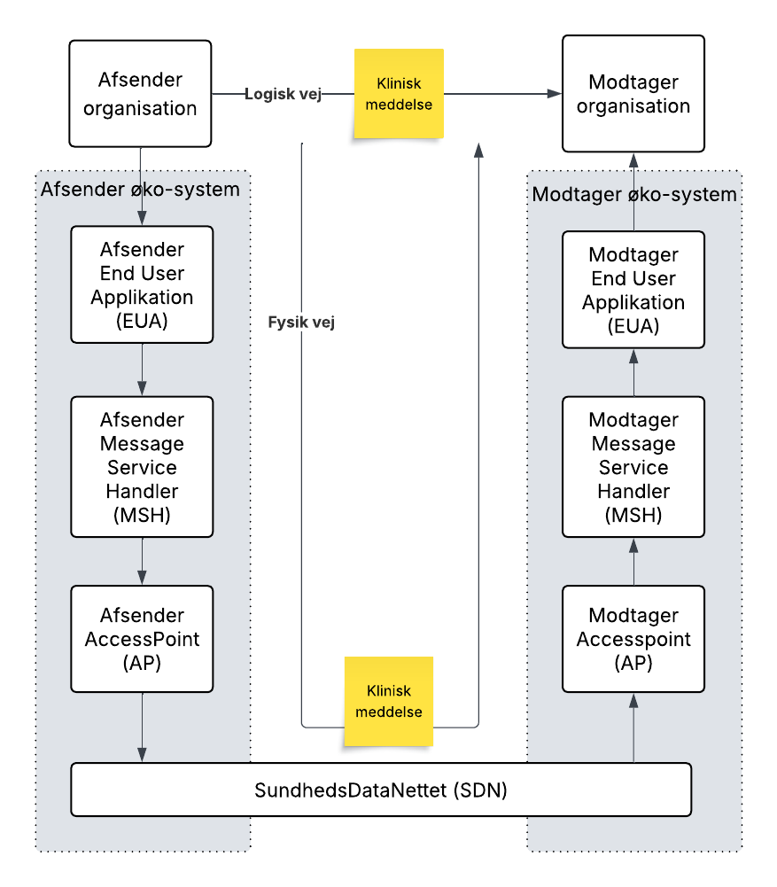
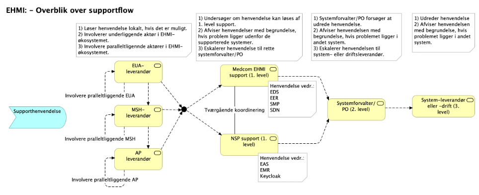

# Startpakke for eDelivery Sundhedsdomænet – pilotprojekt
eDelivery Sundhedsdomænet har til formål at etablere, udvikle og drive en infrastruktur til udveksling af kliniske meddelelser inden for sundhedssektoren samt til og fra andre domæner uden for sundhedsområdet.

Denne startpakke er etableret i forbindelse med eDelivery-pilotprojektet til deltagerne heri. Samtidig er startpakken udformet med henblik på, at den – efter nødvendige tilpasninger – kan videreføres, når eDelivery Sundhedsdomænet overgår til normal drift.

Hvis en aktør ønsker at tilslutte sig eDelivery Sundhedsdomænet, er første skridt at tage kontakt til MedCom. Nogle af de indledende spørgsmål, der kan drøftes, er:
1) Hvad skal eDelivery Sundhedsdomænet anvendes til?
2) Hvilken rolle forventer aktøren at have:
    1) Organisation, der skal sende og modtage kliniske meddelelser via eDelivery Sundhedsdomænet
    2) End User Application (EUA) – leverandør af fagsystem/klinisk system
    3) Message Service Handler (MSH)
    4) Access Point (AP)
3) Hvad er de praktiske trin frem mod tilslutning til eDelivery Sundhedsdomænet – både aftalemæssigt og teknisk?

I det følgende beskrives de aftalemæssige og tekniske trin for tilslutning til eDelivery Sundhedsdomænet.

Beskrivelsen indledes med en kort introduktion til eDelivery Sundhedsdomænet med fokus på de forskellige roller, en aktør kan have. Herefter følger en kort introduktion til de infrastrukturkomponenter, der indgår i eDelivery Sundhedsdomænet.

# Introduktion til eDelivery Sundhedsdomænet, med fokus på roller og infrastruktur komponenter.

(Klik på pilen ud for hver introduktion.)

  
<strong>Introduktion til eDelivery Sundhedsdomænet med fokus på de forskellige roller.</strong>

Tag stilling til hvilken rolle eller roller du ønsker at varetage i eDelivery domænet.
Figuren nedenfor illustrerer, hvordan en klinisk besked sendes fra en afsenderorganisation (f.eks. en kommune) til en modtagerorganisation (f.eks. en praktiserende læge) via eDelivery Sundhedsdomænet. Beskedens fysiske vej går gennem afsender-økosystemet, over sundhedsdatanettet og op gennem modtager-økosystemet.

(Klik på pilen for beskrivelse af nedenstående begreber.)

  
End User Application (EUA)

Det kliniske fagsystem (eller andre fagsystemer), som afsender- og modtagerorganisationen anvender til at registrere og behandle en borgers (patientens) sundhedsoplysninger. 
Når der er behov for at sende en klinisk meddelelse til en anden organisation, sikrer det kliniske system, at meddelelsen opsættes i det relevante kliniske format (f.eks. en HomeCareObservation) og fremfinder den ønskede modtager. Meddelelsen og modtageren overdrages herefter til MSH. Det kliniske system kan også modtage kliniske meddelelser fra andre sundhedsorganisationer via MSH.
Det kliniske system sikrer, at afsendte og modtagne meddelelser kan spores ved at registrere afsendelse og modtagelse i EDS-servicen (EHMI Delivery Status), som er eDelivery Sundhedsdomænets “track-and-trace”-system.

  
Message Service Handler (MSH)

MSH er ansvarlig for klargøring og afsendelse af kliniske meddelelser fra EUA til en udpeget modtager. Klargøringen indebærer at indpakke den kliniske meddelelse i den digitale konvolut (ehmiSBDH), der bruges til udveksling af kliniske meddelelser indenfor eDelivery Sundhedsdomænet. MSH håndterer succes- eller fejl-kvitteringer fra modtageren (ehmiSBDH Acknowledgement). Ved fejl gensendes den kliniske meddelelse. Efter succesfuld afsendelse sendes en kopi af meddelelsen til EMR, en tjeneste til arkivering af kliniske meddelelser sendt via eDelivery Sundhedsdomænet.
MSH modtager også kliniske meddelelser fra andre sundhedsorganisationer, udpakker dem fra den digitale konvolut (ehmiSBDH), returnerer en kvittering (ehmiSBDH Acknowledgement) til afsenderen og sender den udpakkede kliniske meddelelse op til EUA.
MSH sikrer, at afsendte og modtagne meddelelser kan spores ved at registrere afsendelse og modtagelse i EDS-servicen (EHMI Delivery Status), som er eDelivery Sundhedsdomænets “track-and-trace”-system.
MSH overlader den fysiske afsendelse og modtagelse af beskeder og kvitteringer til Accesspoint.

  
Accesspoint (AP)

AP håndterer den fysiske digitale udveksling af kliniske meddelelser sendt via eDelivery Sundhedsdomænet. Den digitale adresse på modtageren hentes via Erhversstyrelsens SMP-service. Meddelelser og kvitteringer indpakkes og krypteres i henhold til EU’s eDelivery protokol og sendes derefter til modtagerens AP via Sundhedsdatanettet. 
Når AP modtager en besked fra en anden AP via Sundhedsdatanettet, står AP for dekryptering og udpakning, før beskeden leveres op til MSH. 
AP sikrer, at afsendte og modtagne meddelelser kan spores ved at registrere afsendelse og modtagelse i EDS-servicen (EHMI Delivery Status), som er eDelivery Sundhedsdomænets “track-and-trace”-system.

  
Sundhedsdatanettet (SDN)

Et lukket og sikret net til udveksling af sundhedsdata.
EUA, MSH og AP kan kombineres på forskellige måder, f.eks. en sammenbygning af EUA og MSH eller en sammenbygning af MSH og AP.

Anvendte protokoller og standarder i eDelivery Sundhedsdomænet findes her: https://ehmi.dk

  
<strong>Introduktion til de Infrastruktur-komponenter som indgår i eDelivery Sundhedsdomænet.</strong>

eDelivery-sundhedsdomænet anviser en række tekniske infrastrukturkomponenter, som den tilsluttede part skal integrere til og anvende, afhængigt af den rolle, parten varetager. Tabellen nedenfor oplister infrastrukturkomponenterne, deres systemforvalter samt de roller i eDelivery-sundhedsdomænet, der skal benytte komponenterne.

| Infrastruktur-komponent | Beskrivelse | Ansvarlig part | Anvender rolle |
|------------------------|------------|----------------|----------------|
| EER | EHMI Endpoint Register  Opslag efter endpoint ID (adresse i form af GLN-nummer) for modtager af meddelelse. | MedCom | EUA - anvendelse ikke påkrævet. |
| EAS | EHMI Addressing Service  Opslag efter korrekt modtager af en meddelelse | Sundhedsdatastyrelsen via den Nationale Service Platform (NSP) | EUA - anvendelse ikke påkrævet. |
| EDS | EHMI Delivery Status  eDelivery Sundhedsdomænets ”track-and-trace”-system | MedCom | 1) EUA 2) MSH 3) AP |
| Keycloak | Sikkerhedskomponent og udsteder de OpenID-adgangsbilletter, som anvendes ved adgang til EDS og EER. | Sundhedsdatastyrelsen via den Nationale Service Platform (NSP) | 1) EUA 2) MSH 3) AP |
| EMR | EHMI Meddelelses Registrering  Service til arkivering af kliniske meddelelser sendt via eDelivery Sundhedsdomænet. | Sundhedsdatastyrelsen via den Nationale Service Platform (NSP) | MSH |
| SMP | Service Metadata Publisher | Erhvervsstyrelsen | AP |
| SDN | Sundhedsdatanettet  Et sikkert og lukket netværk, der forbinder IT-systemer i den danske sundhedssektor | MedCom | AP |

Snitflader til flere at EHMI-infrastrukturkomponenterne findes her: https://ehmi.dk

# Trin for tilslutning til eDelivery Sundhedsdomænet

  
Trin 1 - Indgå tilslutningsaftale for eDelivery sundhedsdomænet

Aftalen giver den tilsluttede part adgang til eDelivery-sundhedsdomænet med det formål at sende og modtage meddelelser i henhold til den eller de rolle(r), som parten varetager i EHMI-økosystemet (Enhanced Healthcare Messaging Infrastructure).

[Tilslutningsaftale](tilslutningsaftale_edelivery.docx)

Tilslutningsaftalen skal udfyldes og underskrives. Herefter sendes tilslutningsaftalen elektronisk til MedCom på medcom@medcom.dk.
Efter modtagelse underskriver MedCom en kopi og tilbagesender kopien til den tilsluttede part som bekræftelse på tilslutningen.

    
Trin 2 - Sikre at nødvendige databehandleraftaler er på plads

Som det fremgår af figuren for EHMI-økosystemet, så findes der 5 roller i EHMI-økosystemet. 
1) Afsender- eller modtagerorganisation.
2) EUA (End-User-Application - også omtalt fagsystem/klinisk system) 
3) MSH (Message-Service-Handler)
4) AP (Access-Point)
5) SDN (Sundheds-Data-Nettet)

En afsender- eller modtagerorganisation er i sidste ende den dataansvarlige og skal sikre, at der er etableret de nødvendige databehandleraftaler gennem hele kæden af øvrige roller i EHMI-økosystemet. Dette kan håndteres som en traditionel kæde-databehandler-model, hvor afsender- eller modtagerorganisationen indgår en databehandleraftale med EUA samt sikrer, at EUA har indgået en underdatabehandleraftale med MSH, og at MSH tilsvarende har indgået en underdatabehandleraftale med AP, osv. Alternativt kan afsender- eller modtagerorganisationen indgå databehandleraftaler direkte med flere led i kæden.
Det er op til den enkelte part selv at vælge databehandlermodel i samarbejde med sine underleverandører.
Ved tilslutning til eDelivery Sundhedsdomænet vil den tilsluttede part blive spurgt, om der foreligger gyldige databehandleraftaler med de relevante parter i overensstemmelse med gældende databeskyttelseslovgivning – eller alternativt, hvad den tilslutede parten har af planer for at sikre dette.

eDelivery-sundhedsdomænet har udarbejdet et eksempel på en databehandleraftale mellem en kommune og et access point, som kan anvendes til inspiration. Vær opmærksom på:
1) at en databehandleraftale altid er kontekstafhængig, og at eksemplet derfor ikke kan anvendes direkte.
2) at en databehandleraftale kan formuleres på mange forskellige måder, og at databehandlerforholdet muligvis allerede er dækket af eksisterende databehandleraftaler med underleverandører.
3) at eksemplet viser en databehandleraftale fra en kommune direkte til et access point. Dette kunne alternativt være håndteret via underdatabehandleraftaler fra kommunens leverandør af fagsystem til MSH og AP.

Eksemplet tager udgangspunkt i en standard skabelon for databehandleraftaler, hvor en stor del af teksten stammer fra skabelonen. De dele af teksten, der specifikt vedrører eDelivery-sundhedsdomænet, er markeret med gult.

[Eksempel på databehandleraftale](Databehandleraftale_eksempel.docx)

  
Trin 3 - Indgå tilslutningsaftaler til benyttede EHMI-infrastrukturkomponenter

Ovenfor (jf. Introduktion til de Infrastruktur-komponenter som indgår i eDelivery Sundhedsdomænet) beskrives de tekniske infrastrukturkomponenter, som den tilsluttede part skal integrere til og anvende afhængigt af den rolle, parten varetager.

Det fremgår desunden at infrastrukturkomponenterne systemforvaltes  hos tre forskellige organisationer:
1) Sundhedsdatastyrelsen via den Nationale Service Platform (NSP) er systemforvalter på Keycloak, EAS og EMR.
2) MedCom er systemforvalter på EER, EDS og SDN
3) Erhvervsstyrelsen er systemforvalter på SMP

Nedenfor beskriver hvordan der indgåes en aftale med hver af de tre systemforvaltere.

  
<strong>Adgang Keycloak, EAS og EMR – SDS/NSP er systemforvalter</strong>

Keycloak, EAS og EMR driftes på Den Nationale Serviceplatform (NSP). Anvenderen skal dels indgå en central aftale med Sundhedsdatastyrelsen (SDS) for at få adgang til NSP og dels whitelistes til de services, der ønskes anvendt.

<strong>Adgang til NSP</strong>
Vejledning vedrørende indgåelse af den centrale aftale med SDS om adgang til NSP findes her: https://www.nspop.dk/spaces/Web3/pages/29987467/Aftaler+for+Anvenderleverandør+og+Serviceaftager 

<strong>Whitelistning til Keycloak</strong>
Adgang til Keycloak Authorization Server forudsætter, at anvenderapplikationen registreres (whitelistes) i Keycloak via metadata, som blandt andet indeholder applikationens certifikat. Til denne whitelistning anvendes et MitID Erhverv systemcertifikat.

<strong>Whitelistning til EAS</strong>
Adgang til EAS forudsætter to ting. 
1) En gyldig adgangsbillet (access token) udstedt af NSP Keycloak, som gælder i en periode og man anvendes hen over flere opslag.
2) Anvenderapplikationen registreres/whitelistes til NSP Keycloak. Til denne whitelistning anvendes et MitId Erhverv Systemcertifikat

<strong>Whitelistning til EMR</strong>
EMR fungerer som Access Point i eDelivery-infrastrukturen og kan modtage meddelelser fra andre Access Points. Whitelistning af Access Points sker via et centralt register hos Erhvervsstyrelsen (SMP).

  
<strong>Adgang EER, EDS og SDN – MedCom er systemejer</strong>

<strong>Adgang til EER</strong>

<em>Medcom laver en vejledning til hvilke metadata der skal leveres</em>

<strong>Adgang til EDS</strong>
?

<strong>Adgang til SDN</strong>
SDN er et sikret netværk til datakommunikation i den danske sundhedssektor for både offentlige og private parter. SDN binder lokale, sikrede net sammen i en fælles infrastruktur – og gør det muligt for de tilsluttede parter både at udstille egne services og indgå aftaler om netværksmæssig adgang til andres services. 

Ved tilslutning til SDN skal indgås både en tilslutningsaftale om brug af SDN samt en databehandleraftale.
Vejledning vedrørende dette findes her: https://medcom.dk/systemforvaltning/sundhedsdatanettet-sdn/startpakke/

  
<strong>Adgang SMP – SDS/NSP er systemforvalter</strong>

    
Trin 4 - Test

I nedenstående tabel fremgår en blanding af krav og testmuligheder opdelt på de forskellige integrationskomponenter. Det fremgår desuden, hvilke roller i EHMI-økosystemet de enkelte krav og test er relevante for.

| ID | Krav til produkter, test og testintegrationer | AP | MSH | EUA |
|----|----------------------------------------------|----|-----|-----|
| 1 | <strong>Godkendte AP-produkter og brug af SMP/SML</strong>  eDelivery Sundhedsområdet følger det fælles offentlige eDelivery retningslinjer på dette område. Disse retningslinjer kommer blandt andet ind på:  at det anvendte AP-produkt skal figurere på EU's liste over "eDelivery AS4 v1.x conformant products". Desuden skal AP-produktet: -Have bestået conformance testen indenfor seneste 3 år. -Overholde "(eDel AS4 1.15) eDelivery AS4 Profile v1.15" -Overholde "(eDel AS4 1.15) AS4 Four Corner Topology Profile Enhancement" -Overholde "(eDel AS4 1.15) AS4 SBDH Profile Enhancement"  *https://ec.europa.eu/digital-building-blocks/sites/spaces/DIGITAL/pages/721846393/eDelivery+AS4+v1.x+conformant+products | X |  |  |
| 2 | <strong>EDS integrationstest</strong>  MedCom stiller en test EDS-service til rådighed.  MedCom udstiller desuden en testplatform, der kan anvendes til test af, om EDS-klienten kan generere valide AuditEvents. | X | X | X |
| 3 | <strong>FAPI 2.0-sikkerhedsprofilen</strong>  Keycloak fungerer som en sikkerhedskomponent og udsteder de OpenID-adgangsbilletter, der anvendes ved adgang til EDS. Overholdelse af FAPI 2.0-sikkerhedsprofilen testes indirekte i forbindelse med EDS- og EAS-integrationstesten. | X | X | X |
| 4 | <strong>Accesspoint tilslutningstest</strong>  Da der stilles krav om godkendte AP-produkter, forventes det, at et AP overholder gældende krav til protokoller og formater.  Formålet med AP-tilslutningstesten er at sikre, at et AP er korrekt konfigureret til at kunne sende og modtage meddelelser via en test-AP i eDelivery Sundhedsdomænet, som MedCom stiller til rådighed. I forbindelse med integrationstesten testes desuden integration til SMP-servicen. | X |  |  |
| 5 | <strong>MSH test</strong>  MedCom udstiller en testplatform, der kan anvendes til test af, om en MSH overholder de nødvendige protokoller og formater for en MSH-service. Tilslutningstesten dækker følgende hovedområder:  1. Overholdelse af ehmiSBDH-profilen. 2. Succesfuld levering af meddelelser til en MSH-modtager. 3. Succesfuld modtagelse af meddelelser fra en MSH-afsender. 4. Håndtering af kvitteringer. 6. Håndtering af semantiske fejl. |  | X |  |
| 6 | <strong>EMR tilslutningstest</strong>  Efter succesfuld levering af en meddelelse til en modtager-MSH skal afsender-MSH uploade meddelelsen til EMR-servicen.  EMR testes indirekte via MSH test.Der er i princippet ikke forskel på afsendelse af en meddelelse til EMR og afsendelse af en meddelelse enhver anden MSH.  Det forventes dog at Afsender-MSH har afprøvet og sikret korrekt afsendelse af meddelelser til EMR på NSP-testsystemer før produktionssætning. |  | X (kun afsender MSH) |  |
| 7 | <strong>Overholdelse af format for kliniske meddelelser (eksempelvis ”HomeCareObservation")</strong>  En EUA skal certificeres i forhold til de kliniske meddelelser, som systemet understøtter, og må kun sende/modtage kliniske meddelelser, som det kliniske system er godkendt til. MedCom forestår denne certificering, og efter gennemført certificering vil den tilsluttede parts løsning fremgå af MedComs godkendelsesoversigt. |  |  | X |
| 8 | <strong>EAS integrationstest</strong>  Sundhedsdatastyrelsen stiller en test EAS-service til rådighed på NSP-testsystemerne. Det forventes, at EUA tester deres løsning op imod EAS på NSP-testsystemerne før produktionssætning. |  |  | X |
| 9 | <strong>EER integrationstest</strong>  MedCom stiller en test EER-service til rådighed. Det forventes at EUA tester deres løsning op imod test EER-servicen før produktionssætning. |  | X | (hvis den benyttes) |

Den tilsluttede part skal certificeres af MedCom, før partens løsning kan tilsluttes eDelivery-sundhedsdomænet. Certificeringen baseres på en testprotokol udviklet af MedCom. Den til enhver tid gældende testprotokol fremgår af www.medcom.dk.

    
Trin 5 - Etabler testmiljø

MedCom, Sundhedsdatastyrelsen og Erhvervsstyrelsen har etableret testmiljøer for følgende infrastrukturkomponenter: EAS, EMR, SMP, Keycloak, EER og EDS.

MedCom har desuden etableret en test-AP og en test-MSH, som tilsluttede parter med rollen AP og MSH kan anvende til at sende og modtage meddelelser via deres egen test-AP eller test-MSH.

MedCom stiller endvidere testplatform til rådighed, som kan anvendes til at teste overholdelse af gældende standarder og profiler. 

Den tilsluttede part skal etablere og vedligeholde et testmiljø med de produkter, som parten ønsker at tilslutte eDelivery-sundhedsdomænet. Testmiljøet skal integrere de relevante testmiljøer og services hos MedCom, Sundhedsdatastyrelsen og Erhvervsstyrelsen.

Testmiljøet bør desuden være integreret med de underliggende testmiljøer hos de aktører i EHMI-økosystemet, som den tilsluttede part er afhængig af, således at end-to-end-test af funktionalitet og integration kan gennemføres.

Den tilsluttede part skal endvidere stille testgrænseflader (testsnitflader) til rådighed i testmiljøet, som partens kunder kan anvende til egne testformål, herunder integrationstest og validering forud for idriftsættelse i produktionsmiljøet.

    
Trin 6 - Etabler supportorganisation

Den tilsluttede part skal informere afsenderen om fejlscenarier, såsom meddelelser med semantiske eller adresseringsfejl, der ikke kan leveres til modtageren.

Den tilsluttede part indgår i eDelivery sundhedsdomænets fælles supportflow som skitseret på figuren.

Den tilsluttede part fastlægger selv sit supportniveau i forhold til egne kunder, dvs. aktører, der er placeret over den tilsluttede part i EHMI-økosystemet.

Den tilsluttede part er forpligtet til at modtage, håndtere og medvirke til udredning af supporthenvendelser fra aktører, der er placeret under eller parallelt med den pågældende part i EHMI-økosystemet.
1) En EUA er forpligtet til at udrede supporthenvendelser fra den underliggende MSH samt fra de EUA’er, som der sendes kliniske meddelelser til og modtages kliniske meddelelser fra.
2) En MSH er forpligtet til at udrede supporthenvendelser fra den underliggende AP samt fra de MSH’er, som der sendes ehmiSBDH-meddelelser til og modtages ehmiSBDH-meddelelser fra.
3) En AP er forpligtet til at udrede supporthenvendelser fra de AP’er, som der sendes AS4-meddelelser til og modtages AS4-meddelelser fra.

Hvis en tilsluttet part har sammenbyggede EUA-, MSH- og/eller AP-komponenter, er parten forpligtet til at håndtere det samlede supportansvar, som de enkelte komponenter hver især er ansvarlige for.

Den tilsluttede part skal etablere og opretholde en bemandet supportfunktion med dertilhørende kontaktkanaler i form af telefonnummer og e-mailadresse, som kan anvendes til indmelding af supporthenvendelser.

Supportfunktionen skal være tilgængelig på hverdage med følgende servicemål:
1) Kvittering for modtagelse:
Modtagelse af en supporthenvendelse skal kvitteres inden for to (2) timer på hverdage inden for normal arbejdstid. Supporthenvendelser, der modtages lørdag, søndag eller på helligdage, skal kvitteres inden for to (2) timer på førstkommende hverdag.
2) Opstart af udredning:
Udredning og fejlsøgning af supporthenvendelsen skal påbegyndes af kvalificeret personale inden for to (2) timer på hverdage regnet fra tidspunktet for kvittering af henvendelsen.

Supporthenvendelser håndteres i overensstemmelse med følgende principper:
1.	Lokal afhjælpning:
Supporthenvendelsen skal i videst muligt omfang løses lokalt af den tilsluttede part, såfremt årsagen til problemet kan henføres til den tilsluttede part eget ansvarsområde.

2.	Koordineret udredning:
Såfremt problemet involverer eller mistænkes at involvere en underliggende eller paralleltliggende aktør i EHMI-økosystemet, skal den tilsluttede part aktivt inddrage den relevante aktør i den videre udredning og fejlsøgning.

3.	Eskaleringspligt:
Kan supporthenvendelsen ikke løses lokalt eller gennem koordination med relevante aktører, er den tilsluttede part forpligtet til rettidigt at eskalere henvendelsen til enten MedCom EHMI Support eller NSP Support, afhængigt af problemets karakter og ansvarsplacering.

MedCom EHMI support håndterer supporthenvendelser vedrørende EDS, EER, SDN og SMP. NSP Support håndterer supporthenvendelser vedrørende EAS, EMR og Keycloak.

MedCom EHMI support og NSP Support kan efter behov eskalere supporthenvendelser videre til de relevante systemforvaltere (Product Owners) og systemleverandører.

    
Trin 7 - Etabler produktionsmiljø

I det produktion miljø som den tilsluttede part etablere skal det sikres, at meddelelser ikke går tabt i perioden fra de er modtaget og kvitteret for af Partens løsning, og indtil meddelelsen er videreformidlet til modtager, og modtageren har kvitteret for modtagelsen.

Parten skal etablere og opretholde tekniske og organisatoriske mekanismer, der sikrer, at meddelelser i dette forløb håndteres på en måde, så de kan spores, genoptages og reetableres ved fejl eller nedbrud. Dette omfatter som minimum:
1)	vedvarende lagring og sporbarhed af meddelelser samt tilhørende kvitteringer, indtil de er færdigbehandlet.
2)	mekanismer, der sikrer, at en meddelelse først betragtes som endeligt afleveret, når modtagerens kvittering er modtaget og registreret,
3)	automatisk genoptagelse af videreformidling efter nedbrud, herunder genforsøg og håndtering af midlertidige fejltilstande,
4)	procedurer for reetablering, så meddelelser, der er modtaget, ikke bortfalder eller efterlades ubehandlede.

Såfremt der konstateres forhold, der medfører risiko for tab af meddelelser, skal Parten uden unødig forsinkelse iværksætte afhjælpende foranstaltninger.

# Kontakt ved spørgsmål om tilslutning

MedCom

Mail: medcom@medcom.dk 

Telefon: (+45) xxxx xxxx
