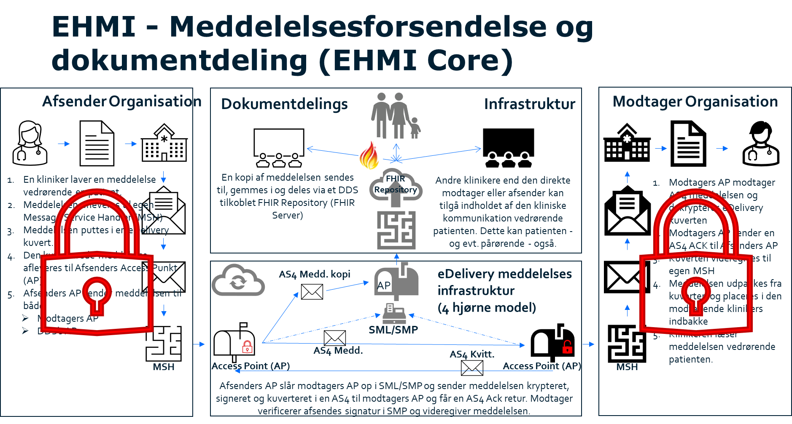

# Specification of security regarding message flow in EHMI Core 

***

    **Disclaimer** 
    
    **The menu items above marked with a star are yet not specified**

    ***Shifts of languages between English and Danish will occur in this version - that will change completely to English in the next upcoming version***
   
  

## Table of content

- [2.1 Generelle sikkerhedsmæssige definitioner for komponenter i forsendelseskæden](#generelle-sikkerhedsmæssige-definitioner-for-komponenter-i-forsendelseskæden)

- [3 Generelt omkring sikkerhed for komponenter i EHMI](#generelt-omkring-sikkerhed-for-komponenter-i-ehmi)

- [4 Specifikationer - sikkerhed vedrørende meddelelseskommunikation](#specifikationer---sikkerhed-vedrørende-meddelelseskommunikation)

- [4.1 Decentralt vedrørende sikkerhed](#decentralt-vedrørende-sikkerhed)

- [4.2 Alle komponenter stand-alone - implementeret på forskellige servere](#alle-komponenter-stand-alone---implementeret-på-forskellige-servere)

- [4.3 Alle komponenter stand-alone - grupperet sammen på samme server](#alle-komponenter-stand-alone---grupperet-sammen-på-samme-server)

- [4.4 Alle komponenter stand-alone - afsendende fagsystem og MSH grupperet sammen på samme server](#alle-komponenter-stand-alone---afsendende-fagsystem-og-msh-grupperet-sammen-på-samme-server)

- [4.5 Alle komponenter stand-alone, MSH og AP grupperet sammen på samme server](#alle-komponenter-stand-alone-msh-og-ap-grupperet-sammen-på-samme-server)

- [4.6 Afsendende fagsystem stand-alone - MSH/AP sammenbygget - implementeret på forskellige servere](#afsendende-fagsystem-stand-alone---mshap-sammenbygget---implementeret-på-forskellige-servere)

- [4.7 Afsendende fagsystem stand-alone - MSH/AP sammenbygget – alle grupperet sammen på samme server](#afsendende-fagsystem-stand-alone---mshap-sammenbygget--alle-grupperet-sammen-på-samme-server)

- [4.8 Afsendende fagsystem/MSH sammenbygget – AP stand-alone - implementeret på forskellige servere](#afsendende-fagsystemmsh-sammenbygget--ap-stand-alone---implementeret-på-forskellige-servere)

- [4.9 Afsendende fagsystem/MSH sammenbygget – AP stand-alone – alle grupperet sammen på samme server](#afsendende-fagsystemmsh-sammenbygget--ap-stand-alone--alle-grupperet-sammen-på-samme-server)

- [4.10 Afsendende fagsystem/MSH sammenbygget – MSH/AP sammenbygget - implementeret på forskellige servere](#afsendende-fagsystemmsh-sammenbygget--mshap-sammenbygget---implementeret-på-forskellige-servere)

- [4.11 Afsendende fagsystem/MSH sammenbygget – MSH/AP sammenbygget – alle grupperet sammen på samme server](#afsendende-fagsystemmsh-sammenbygget--mshap-sammenbygget--alle-grupperet-sammen-på-samme-server)

- [4.12 Alle komponenter sammenbyggede](#alle-komponenter-sammenbyggede)

- [4.13 Modtagersiden](#modtagersiden)

  

## General security definitions regarding components in the delivery chain

The following definitions regarding all systems/components in EHMI applies:

-   Systems/components can be a stand-alone applications or **build-in** with one or more systems/components in the message flow.
-   Systems/components can be a stand-alone application **grouped together** with one or more systems/components in the message flow on the same server.

  

### General information about security for components in EHMI

It is possible to report and access data via a FHIR API. Web-services/RESTful-services, which are exposed via such interface, must, like other national web-services in the healthcare area, comply with national architecture and national standards.

This means, among other things, that in case of personal identifiable information:

A strong authentication of users must take place (according to NIST niveau 3-4 or NSIS niveau “significant”)

1.  Access control must be carried out based on nationally standardized information (attributes)
2.  Consent/rejection and treatment relationship must be checked against the national consent service and the national treatment relationship service
3.  Information about healthcare professionals’ access to personal data must be viewable for the citizen/patient via MinLog

  

## Specifications – security regarding message communication

First, the general guidelines regarding security in the message flow in EHMI are described. Secondly, it is described for the different scenarios of **interconnections** and **grouping**, cf. [General security definitions regarding components in the delivery chain](#general-security-definitions-regarding-components-in-the-delivery-chain) how the guidelines is implemented in the individual scenarios.  

  

### Decentralized regarding security

The following table illustrates in general, how the guidelines are regarding security in the message flow in EHMI.

| **EHMI components**                                              | **Subtask**                                                                                                                                      | **Who**                   |
|-------------------------------------------------------------------|----------------------------------------------------------------------------------------------------------------------------------------------------|----------------------------|
| Between stand-alone components/services.                          | **Authenticity management:** Implementation of signing of delivering.                                                                           | Afsenderkomponent          |
| Between stand-alone components/services.                          | **Authenticity management:** Verification of signature upon receipt.                                                                             | Receiver component          |
| Between components/services, that are handled on different servers | **Integrity protection and confidentiality protection:** Communication of a message / message content / envelope via secured transport protocol, e.g. TLS | Sender/receiver component |

**Autenticity management between C1 and C2 (cf. section 6.1.1 in Målbilledet):**

*In the health sector, there is a requirement that the message and/or the envelope is signed in C1, and that this signature is subsequently verified in C2. This way, the authentication of C1 is ensured in C2. This authentication will be a part of the agreement between the AP and the system, which the AP acts on behalf of. This is ensured by explicit signing between the sending system/MSH/AP (with associated verification) on system certificate level (VOCES/FOCES/Level 3). This can, for example, be ensured via DGWS/IDWS or similar.*

**Integrity protection between C1 and C2 (cf. section 6.1.2 in Målbilledet):**

*This is ensured, in addition to the envelope signing described under authenticity (section 6.1.1), via the protocols used between the Aps and the systems, which the Aps acts on behalf of, e.g. TLS (Transport Layer Security).*

**Confidentiality between C1 and C2 (cf. section 6.1.4 in Målbilledet):**

*As all messages under the health domain basically contain sensitive personal data, the encryption must be used, when it is possible. Therefore, the message must be encrypted between sender and the sending AP via MSH (C1 and C2) as well as between the receiving AP and receiver via MSH (C3 and C4). The use of this encryption will be part of the agreement between the AP and the system, which the AP acts on behalf of. This is ensured as via the integrity protection.*

*The above also applies to all communication between C3 and C4.*

  

### All components stand-alone – implemented on different servers

  

| **EHMI components**                              | **Subtask**                                                                                                                 | **Who**                    |
|---------------------------------------------------|-------------------------------------------------------------------------------------------------------------------------------|-----------------------------|
| Sending system stand-alone                  | **Authenticity management:** Implementation of message signing                                                        | Sending system        |
| MSH stand-alone                                   | **Authenticity management:** Verification of signing upon receipt.                                                        | MSH                         |
| Sending system stand-alone 
MSH stand-alone  | **Integritetssikring og fortrolighedssikring:** Communication of a message / envelope via secured transport protocol, e.g. TLS | Sending system and MSH |
| MSH stand-alone                                   | **Authenticity management:** Implementation of message signing                                                        | MSH                         |
| AP stand-alone                                    | **Authenticity management:** Verification of signing upon receipt.                                                        | AP                          |
| MSH stand-alone AP stand-alone                    | **Integrity protection and confidentiality protection:** Communication of a message / envelope via secured transport protocol, e.g. TLS | MSH and AP                   |

  

### Alle komponenter stand-alone - grupperet sammen på samme server

  

| **EHMI Komponenter**              | **Delopgave**                                                          | **Hvem**             |
|-----------------------------------|------------------------------------------------------------------------|----------------------|
| Afsendende fagsystem stand-alone  | **Authenticity management:** Implementation of message signing | Afsendende fagsystem |
| MSH stand-alone                   | **Authenticity management:** Verification of signing upon receipt. | MSH                  |
| MSH stand-alone                   | **Authenticity management:** Implementation of message signing | MSH                  |
| AP stand-alone                    | **Authenticity management:** Verifikation af signering ved modtagelse. | AP                   |

  

### Alle komponenter stand-alone - afsendende fagsystem og MSH grupperet sammen på samme server

  

| **EHMI Komponenter**              | **Delopgave**                                                                                                                 | **Hvem**             |
|-----------------------------------|-------------------------------------------------------------------------------------------------------------------------------|----------------------|
| Afsendende fagsystem stand-alone  | **Authenticity management:** Implementation of message signing                                                        | Afsendende fagsystem |
| MSH stand-alone                   | **Authenticity management:** Verifikation af signering ved modtagelse.                                                        | MSH                  |
| MSH stand-alone                   | **Authenticity management:** Implementation of message signing                                                        | MSH                  |
| AP stand-alone                    | **Authenticity management:** Verifikation af signering ved modtagelse.                                                        | AP                   |
| MSH stand-alone AP stand-alone    | **Integritetssikring og fortrolighedssikring:** Kommunikation af meddelelse/konvolut via sikret transportprotokol, f.eks. TLS | MSH og AP            |

  

### Alle komponenter stand-alone, MSH og AP grupperet sammen på samme server

| **EHMI Komponenter**                              | **Delopgave**                                                                                                                 | **Hvem**                     |
|---------------------------------------------------|-------------------------------------------------------------------------------------------------------------------------------|------------------------------|
| Afsendende fagsystem stand-alone                  | **Authenticity management:** Implementation of message signing                                                        | Afsendende fagsystem         |
| MSH stand-alone                                   | **Authenticity management:** Verifikation af signering ved modtagelse.                                                        | MSH                          |
| Afsendende fagsystem stand-alone MSH stand-alone  | **Integritetssikring og fortrolighedssikring:** Kommunikation af meddelelse/konvolut via sikret transportprotokol, f.eks. TLS | Afsendende fagsystem og MSH  |
| MSH stand-alone                                   | **Authenticity management:** Implementation of message signing                                                        | MSH                          |
| AP stand-alone                                    | **Authenticity management:** Verifikation af signering ved modtagelse.                                                        | AP                           |

  

### Afsendende fagsystem stand-alone - MSH/AP sammenbygget - implementeret på forskellige servere

| **EHMI Komponenter**                    | **Delopgave**                                                                                                                 | **Hvem**                       |
|-----------------------------------------|-------------------------------------------------------------------------------------------------------------------------------|--------------------------------|
| Afsendende fagsystem stand-alone        | **Authenticity management:** Implementation of message signing                                                        | Afsendende fagsystem           |
| MSH/AP                                  | **Authenticity management:** Verifikation af signering ved modtagelse.                                                        | MSH/AP                         |
| Afsendende fagsystem stand-alone MSH/AP | **Integritetssikring og fortrolighedssikring:** Kommunikation af meddelelse/konvolut via sikret transportprotokol, f.eks. TLS | Afsendende fagsystem og MSH/AP |

  

### Afsendende fagsystem stand-alone - MSH/AP sammenbygget – alle grupperet sammen på samme server

| **EHMI Komponenter**              | **Delopgave**                                                          | **Hvem**             |
|-----------------------------------|------------------------------------------------------------------------|----------------------|
| Sending system stand-alone  | **Authenticity management:** Implementation of message signing | Sending system |
| MSH/AP                            | **Authenticity management:** Verifikation af signering ved modtagelse. | MSH/AP               |

  

### Afsendende fagsystem/MSH sammenbygget – AP stand-alone - implementeret på forskellige servere

| **EHMI Komponenter**                      | **Delopgave**                                                                                                                 | **Hvem**                       |
|-------------------------------------------|-------------------------------------------------------------------------------------------------------------------------------|--------------------------------|
| Afsendende fagsystem/MSH                  | **Authenticity management:** Implementation of message signing                                                        | Afsendende fagsystem/MSH       |
| AP Stand-alone                            | **Authenticity management:** Verifikation af signering ved modtagelse.                                                        | AP                             |
| Afsendende fagsystem/MSH  AP Stand-alone  | **Integritetssikring og fortrolighedssikring:** Kommunikation af meddelelse/konvolut via sikret transportprotokol, f.eks. TLS | Afsendende fagsystem/MSH og AP |

  

### Afsendende fagsystem/MSH sammenbygget – AP stand-alone – alle grupperet sammen på samme server

| **EHMI Komponenter**     | **Delopgave**                                                          | **Hvem**                 |
|--------------------------|------------------------------------------------------------------------|--------------------------|
| Afsendende fagsystem/MSH | **Authenticity management:** Implementation of message signing | Afsendende fagsystem/MSH |
| AP Stand-alone           | **Authenticity management:** Verifikation af signering ved modtagelse. | AP                       |

  

### Afsendende fagsystem/MSH sammenbygget – MSH/AP sammenbygget - implementeret på forskellige servere

Vi har erfaret gennem samtaler med de deltagende parter, at et scenarie som dette kan være muligt. I så fald er det vigtigt at parter med et sådant setup aftaler, hvilken MSH, der er primær med udfyldelse af MSH forpligtelserne og hvilken MSH, der blot viderestiller informationer til næste led i kæden. Når dette er på plads, vil følgende sikkerhedsanvisninger være gældende.

| **EHMI Komponenter**                | **Delopgave**                                                                                                                 | **Hvem**                           |
|-------------------------------------|-------------------------------------------------------------------------------------------------------------------------------|------------------------------------|
| Afsendende fagsystem/MSH            | **Authenticity management:** Implementation of message signing                                                        | Afsendende fagsystem/MSH           |
| Afsendende MSH/AP                   | **Authenticity management:** Verifikation af signering ved modtagelse.                                                        | MSH/AP                             |
| Afsendende fagsystem/MSH og MSH/AP  | **Integritetssikring og fortrolighedssikring:** Kommunikation af meddelelse/konvolut via sikret transportprotokol, f.eks. TLS | Afsendende fagsystem/MSH og MSH/AP |

  

### Afsendende fagsystem/MSH sammenbygget – MSH/AP sammenbygget – alle grupperet sammen på samme server

| **EHMI Komponenter**     | **Delopgave**                                                          | **Hvem**                 |
|--------------------------|------------------------------------------------------------------------|--------------------------|
| Afsendende fagsystem/MSH | **Authenticity management:** Implementation of message signing | Afsendende fagsystem/MSH |
| Afsendende MSH/AP        | **Authenticity management:** Verifikation af signering ved modtagelse. | MSH/AP                   |

  

### Alle komponenter sammenbyggede

Da alle komponenter her er sammenbyggede, håndteres al sikkerhed internt i sammenbygningen, og der er derfor ikke behov for eksplicit at udtrykke noget om sikkerheden her.

  

### Modtagersiden

Ovenstående er kun beskrevet, hvordan sikkerheden ser ud på afsendersiden. De tilsvarende mekanismer implementeres naturligvis også på modtagersider, hvor de så bare anvendes i den modsatte rækkefølge og med de tilsvarende aktører i modsat rækkefølge.

  

