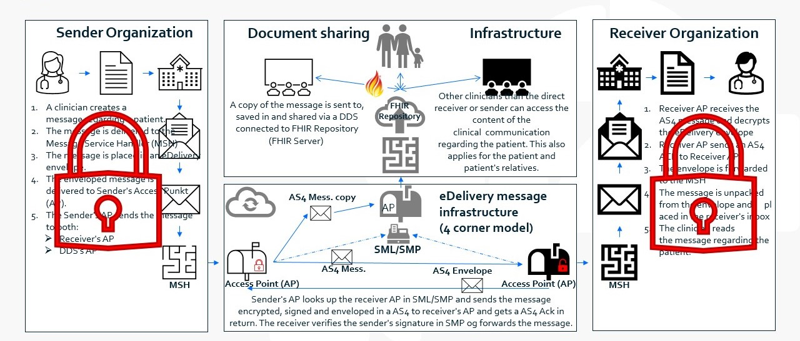
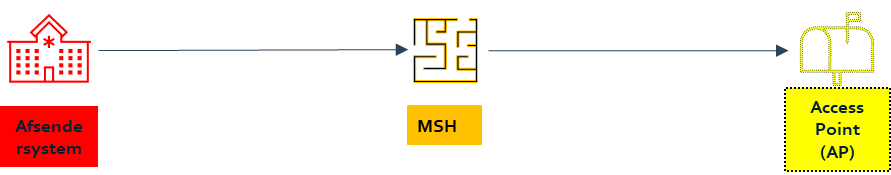
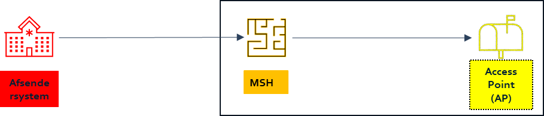

# Specification of security regarding message flow in EHMI Core 

***

    **Disclaimer** 
    
    **The menu items above marked with a star are yet not specified**

    ***Shifts of languages between English and Danish will occur in this version - that will change completely to English in the next upcoming version***
   
  

## Table of content

- [General security definitions regarding components in the delivery chain](#general-security-definitions-regarding-components-in-the-delivery-chain)

- [General information about security for components in EHMI](#general-information-about-security-for-components-in-ehmi)

- [Specifications – security regarding message communication](#specifications---security-regarding-message-communication)

- [Decentralized regarding security](#decentralized-regarding-security)

- [All components stand-alone – implemented on different servers](#all-components-stand-alone---implemented-on-different-servers)

- [All components stand-alone - grouped together on the same server](#all-components-stand-alone---grouped-together-on-the-same-server)

- [All components stand-alone - sending system and MSH grouped together on the same server](#all-components-stand-alone---sending-system-and-msh-grouped-together-on-the-same-server)

- [All components stand-alone, MSH and AP grouped together on the same server](#all-components-stand-alone-msh-and-ap-grouped-together-on-the-same-server)

- [Sending system stand-alone - MSH/AP build together - implemented on different servers](#sending-system-stand-alone---mshap-build-together---implemented-on-different-servers)

- [Sending system stand-alone - MSH/AP build together - all grouped together on the same server](#sending-system-stand-alone---mshap-build-together---all-grouped-together-on-the-same-server)

- [Sending system/MSH build together – AP stand-alone - implemented on different servers](#sending-systemmsh-build-together---ap-stand-alone---implemented-on-different-servers)

- [Sending system/MSH build together – AP stand-alone - all grouped together on the same server](#sending-systemmsh-build-together---ap-stand-alone---all-grouped-on-the-same-server)

- [Sending system/MSH build together – MSH/AP build together - implemented on different servers](#sending-systemmsh-build-together---mshap-build-together---implemented-on-different-servers)

- [Sending system/MSH build together – MSH/AP build together - all grouped together on the same server](#sending-systemmsh-build-together---mshap-build-together---all-grouped-on-the-same-server)

- [All components build together](#all-components-build-together)

- [Receiver](#Receiver)

  

## General security definitions regarding components in the delivery chain

The following definitions regarding all systems/components in EHMI applies:

-   Systems/components can be a stand-alone applications or **build-in** with one or more systems/components in the message flow.
-   Systems/components can be a stand-alone application **grouped together** with one or more systems/components in the message flow on the same server.

  

### General information about security for components in EHMI

It is possible to report and access data via a FHIR API. Web-services/RESTful-services, which are exposed via such interface, must, like other national web-services in the healthcare area, comply with national architecture and national standards.

This means, among other things, that in case of personal identifiable information:

A strong authentication of users must take place (according to NIST niveau 3-4 or NSIS niveau “substantial”)

1.  Access control must be carried out based on nationally standardized information (attributes)
2.  Consent/rejection and treatment relationship must be checked against the national consent service and the national treatment relationship service
3.  Information about healthcare professionals’ access to personal data must be viewable for the citizen/patient via MinLog

  

## Specifications – security regarding message communication

First, the general guidelines regarding security in the message flow in EHMI are described. Secondly, it is described for the different scenarios of **interconnections** and **grouping**, cf. [General security definitions regarding components in the delivery chain](#general-security-definitions-regarding-components-in-the-delivery-chain) how the guidelines is implemented in the individual scenarios.  

  

### Decentralized regarding security

The following table illustrates in general, how the guidelines are regarding security in the message flow in EHMI.

| **EHMI components**                                              | **Subtask**                                                                                                                                      | **Who**                   |
|-------------------------------------------------------------------|----------------------------------------------------------------------------------------------------------------------------------------------------|----------------------------|
| Between stand-alone components/services.                          | **Authenticity management:** Implementation of signing of delivering.                                                                           | Afsenderkomponent          |
| Between stand-alone components/services.                          | **Authenticity management:** Verification of signature upon receipt.                                                                             | Receiver component          |
| Between components/services, that are handled on different servers | **Integrity protection and confidentiality protection:** Communication of a message / message content / envelope via secured transport protocol, e.g. TLS | Sender/receiver component |

**Autenticity management between C1 and C2 (cf. section 6.1.1 in the Architectural Vision):**

*In the health sector, there is a requirement that the message and/or the envelope is signed in C1, and that this signature is subsequently verified in C2. This way, the authentication of C1 is ensured in C2. This authentication will be a part of the agreement between the AP and the system, which the AP acts on behalf of. This is ensured by explicit signing between the sending system/MSH/AP (with associated verification) on system certificate level (VOCES/FOCES/Level 3). This can, for example, be ensured via DGWS/IDWS or similar.*

**Integrity protection between C1 and C2 (cf. section 6.1.2 in the Architectural Vision):**

*This is ensured, in addition to the envelope signing described under authenticity (section 6.1.1), via the protocols used between the Aps and the systems, which the Aps acts on behalf of, e.g. TLS (Transport Layer Security).*

**Confidentiality between C1 and C2 (cf. section 6.1.4 in the Architectural Vision):**

*As all messages under the health domain basically contain sensitive personal data, the encryption must be used, when it is possible. Therefore, the message must be encrypted between sender and the sending AP via MSH (C1 and C2) as well as between the receiving AP and receiver via MSH (C3 and C4). The use of this encryption will be part of the agreement between the AP and the system, which the AP acts on behalf of. This is ensured as via the integrity protection.*

*The above also applies to all communication between C3 and C4.*

  

### All components stand-alone – implemented on different servers

  

| **EHMI components**                              | **Subtask**                                                                                                                 | **Who**                    |
|---------------------------------------------------|-------------------------------------------------------------------------------------------------------------------------------|-----------------------------|
| Sending system stand-alone                  | **Authenticity management:** Implementation of message signing                                                        | Sending system        |
| MSH stand-alone                                   | **Authenticity management:** Verification of signing upon receipt.                                                        | MSH                         |
| Sending system stand-alone MSH stand-alone  | **Integritetssikring og fortrolighedssikring:** Communication of a message / envelope via secured transport protocol, e.g. TLS | Sending system and MSH |
| MSH stand-alone                                   | **Authenticity management:** Implementation of message signing                                                        | MSH                         |
| AP stand-alone                                    | **Authenticity management:** Verification of signing upon receipt.                                                        | AP                          |
| MSH stand-alone AP stand-alone                    | **Integrity protection and confidentiality protection:** Communication of a message / envelope via secured transport protocol, e.g. TLS | MSH and AP                   |

  

### All components stand-alone - grouped together on the same server

  

| **EHMI components**              | **Subtask**                                                          | **Who**             |
|-----------------------------------|------------------------------------------------------------------------|----------------------|
| Sending system stand-alone  | **Authenticity management:** Implementation of message signing | Afsendende fagsystem |
| MSH stand-alone                   | **Authenticity management:** Verification of signing upon receipt. | MSH                  |
| MSH stand-alone                   | **Authenticity management:** Implementation of message signing | MSH                  |
| AP stand-alone                    | **Authenticity management:** Verification of signing upon receipt. | AP                   |

  

### All components stand-alone - sending system and MSH grouped together on the same server

  

| **EHMI components**              | **Subtask**                                                                                                                 | **Who**             |
|-----------------------------------|-------------------------------------------------------------------------------------------------------------------------------|----------------------|
| Sending system stand-alone  | **Authenticity management:** Implementation of message signing                                                        | Sending system |
| MSH stand-alone                   | **Authenticity management:** Verification of signing upon receipt.                                                        | MSH                  |
| MSH stand-alone                   | **Authenticity management:** Implementation of message signing                                                        | MSH                  |
| AP stand-alone                    | **Authenticity management:** Verification of signing upon receipt.                                                        | AP                   |
| MSH stand-alone AP stand-alone    | **Integrity protection and confidentiality protection:** Communication of a message / envelope via secured transport protocol, e.g. TLS | MSH and AP            |

  

### All components stand-alone, MSH and AP grouped together on the same server

| **EHMI components**                              | **Subtask**                                                                                                                 | **Who**                     |
|---------------------------------------------------|-------------------------------------------------------------------------------------------------------------------------------|------------------------------|
| Sending system stand-alone                  | **Authenticity management:** Implementation of message signing                                                        | Sending system         |
| MSH stand-alone                                   | **Authenticity management:** Verification of signing upon receipt.                                                        | MSH                          |
| Afsendende fagsystem stand-alone MSH stand-alone  | **Integrity protection and confidentiality protection:** Communication of a message / envelope via secured transport protocol, e.g. TLS | Sending system and MSH  |
| MSH stand-alone                                   | **Authenticity management:** Implementation of message signing                                                        | MSH                          |
| AP stand-alone                                    | **Authenticity management:** Verification of signing upon receipt.                                                        | AP                           |

  

### Sending system stand-alone - MSH/AP build together - implemented on different servers

| **EHMI components**                    | **Subtask**                                                                                                                 | **Who**                       |
|-----------------------------------------|-------------------------------------------------------------------------------------------------------------------------------|--------------------------------|
| Sending system stand-alone        | **Authenticity management:** Implementation of message signing                                                        | Sending system           |
| MSH/AP                                  | **Authenticity management:** Verification of signing upon receipt.                                                        | MSH/AP                         |
| Sending system stand-alone MSH/AP | **Integrity protection and confidentiality protection:** Communication of a message / envelope via secured transport protocol, e.g. TLS | Sending system and MSH/AP |

  

### Sending system stand-alone - MSH/AP build together – all grouped together on the same server

| **EHMI components**              | **Subtask**                                                          | **Who**             |
|-----------------------------------|------------------------------------------------------------------------|----------------------|
| Sending system stand-alone  | **Authenticity management:** Implementation of message signing | Sending system |
| MSH/AP                            | **Authenticity management:** Verification of signing upon receipt. | MSH/AP               |

  

### Sending system/MSH build together – AP stand-alone – implemented on different servers

| **EHMI components**                      | **Subtask**                                                                                                                 | **Who**                       |
|-------------------------------------------|-------------------------------------------------------------------------------------------------------------------------------|--------------------------------|
| Sending system/MSH                  | **Authenticity management:** Implementation of message signing                                                        | Sending system/MSH       |
| AP Stand-alone                            | **Authenticity management:** Verification of signing upon receipt.                                                        | AP                             |
| Sending system/MSH  AP Stand-alone  | **Integrity protection and confidentiality protection:** Communication of a message / envelope via secured transport protocol, e.g. TLS | Sending system/MSH and AP |

  

### Sending system/MSH build together – AP stand-alone – all grouped together on the same server

| **EHMI components**     | **Subtask**                                                          | **Who**                 |
|--------------------------|------------------------------------------------------------------------|--------------------------|
| Sending system/MSH | **Authenticity management:** Implementation of message signing | Sending system/MSH |
| AP Stand-alone           | **Authenticity management:** Verification of signing upon receipt. | AP                       |

  

### Sending system/MSH build together – MSH/AP build together - implemented on different servers

Through dialog with the participating parties, we have learned that this scenario is possible. In that case, it is important, that parties with this kind of setup agree on which MSH is the primary with fulfilling the MSH obligations, and which MSH simply forwards information to the next link in the chain. Once this is in place , the following security instructions will apply. 

| **EHMI components**                | **Subtask**                                                                                                                 | **Who**                           |
|-------------------------------------|-------------------------------------------------------------------------------------------------------------------------------|------------------------------------|
| Sending system/MSH            | **Authenticity management:** Implementation of message signing                                                        | Sending system/MSH           |
| Sending MSH/AP                   | **Authenticity management:** Verification of signing upon receipt.                                                        | MSH/AP                             |
| Sending system/MSH and MSH/AP  | **Integrity protection and confidentiality protection:** Communication of a message / envelope via secured transport protocol, e.g. TLS | Sending system/MSH and MSH/AP |

  

### Sending system/MSH build together – MSH/AP build together – all grouped together on the same server

| **EHMI components**     | **Subtask**                                                          | **Who**                 |
|--------------------------|------------------------------------------------------------------------|--------------------------|
| Sending system/MSH | **Authenticity management:** Implementation of message signing | Sending system/MSH |
| Sending MSH/AP        | **Authenticity management:** Verification of signing upon receipt. | MSH/AP                   |

  

### All components build together

In this scenario, all components are built together, and therefore all security is handled internally in the assembly/sammenbygning, which means that there is no need to explicitly describe security here.

  

### Receiver

The above only describes how security looks on the sender’s side. The corresponding mechanisms are, of course, also implemented on the recipient side. On the recipient side, the mechanisms are simply used in the opposite order with the corresponding actors/parties in opposite order. 

  

